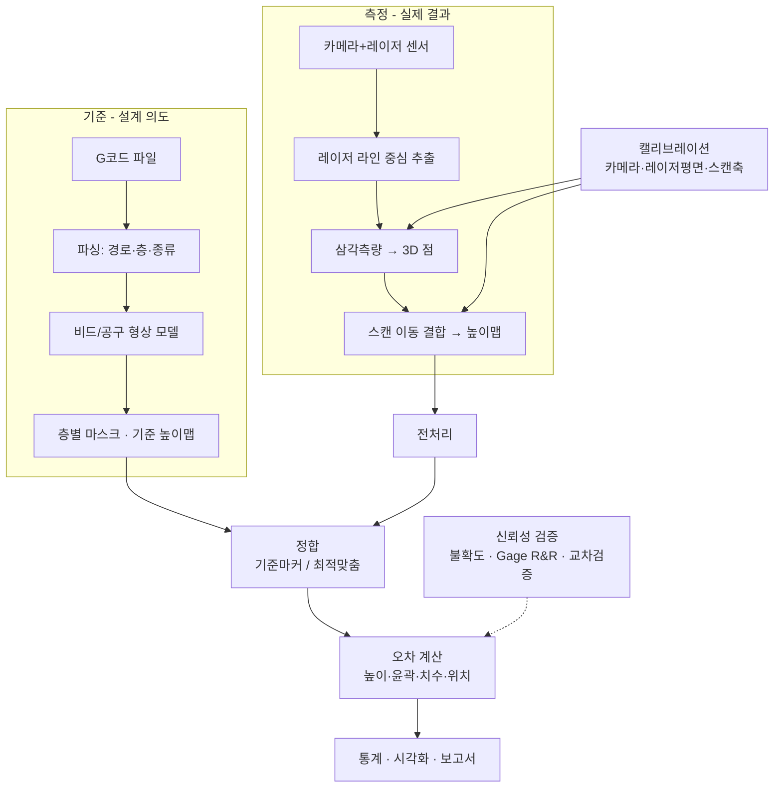
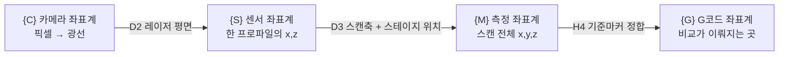

# 청사진 v2: 레이저 삼각측량 기반 G코드 대비 형상 오차 정량 측정

> **측정 방식 확정: 레이저 삼각측량** (라이다는 제외)
> 대상: 대학 소규모 연구실 · 언어: Python · 독자: Python 완전 초보 포함
> 이 문서는 과제를 수행할 때 **고려해야 하는 모든 요소를 11개 영역, 55개 요소로 나누고**, 요소마다 상세히 설명합니다.

---

## 목차

- [0. 이 문서 읽는 법 & 전체 요소 지도](#0-이-문서-읽는-법--전체-요소-지도)
- [A. 목표 · 요구사항](#a-목표--요구사항)
- [B. 측정 원리 · 광학 설계](#b-측정-원리--광학-설계)
- [C. 기구 · 환경 · 안전](#c-기구--환경--안전)
- [D. 캘리브레이션](#d-캘리브레이션)
- [E. 측정 대상(시편)](#e-측정-대상시편)
- [F. 데이터 획득](#f-데이터-획득)
- [G. G코드 기준 모델 (마스킹)](#g-g코드-기준-모델-마스킹)
- [H. 처리 · 분석](#h-처리--분석)
- [I. 측정 신뢰성 검증](#i-측정-신뢰성-검증)
- [J. 소프트웨어](#j-소프트웨어)
- [K. 프로젝트 운영](#k-프로젝트-운영)
- [부록 1. 결정 사항 체크리스트](#부록-1-결정-사항-체크리스트)
- [부록 2. 용어집 (초보자용)](#부록-2-용어집-초보자용)

---

## 0. 이 문서 읽는 법 & 전체 요소 지도

### 0.1 각 요소의 서술 형식
요소마다 아래 항목을 (해당되는 것만) 적었습니다.

- **무엇** – 이 요소가 무엇인지
- **왜 중요** – 무시하면 어떤 문제가 생기는지
- **결정할 것 / 권장값** – 연구실에서 정해야 하는 값과 추천
- **방법** – 구체적인 수행 절차 (필요하면 Python 코드)
- **완료 기준** – "이 요소는 끝났다"고 판단하는 기준
- **흔한 실수** – 초보자가 자주 빠지는 함정

### 0.2 전체 흐름



### 0.3 요소 지도 (총 55개)

| 영역 | 요소 |
|---|---|
| **A. 목표·요구사항** | A1 오차의 정의 · A2 요구 정밀도와 사양 도출 · A3 가공 공정 확정 |
| **B. 측정 원리·광학** | B1 삼각측량 원리와 공식 · B2 기하 배치(각도·거리) · B3 상용 vs 자작 · B4 카메라 · B5 렌즈 · B6 레이저 광원 · B7 광학 필터 |
| **C. 기구·환경·안전** | C1 스캔 이동 장치 · C2 측정 시점(공정 중/후) · C3 지그·기준마커 · C4 좌표계 체계 · C5 주변광 · C6 온도 · C7 진동 · C8 레이저 안전 |
| **D. 캘리브레이션** | D1 카메라 내부 · D2 레이저 평면 · D3 스캔 축 · D4 센서↔기계 좌표 · D5 검증·이력 관리 |
| **E. 측정 대상** | E1 표면 광학 특성 · E2 가림·엣지 효과 · E3 시편 설계 |
| **F. 데이터 획득** | F1 레이저 라인 중심 추출 · F2 획득 파라미터 · F3 저장 형식·메타데이터 |
| **G. G코드 기준 모델** | G1 G코드 파싱 · G2 비드/공구 형상 모델 · G3 마스크·높이맵 생성 · G4 비교 영역(마스킹) 정의 · G5 CAD 기준과의 관계 |
| **H. 처리·분석** | H1 점→격자 변환 · H2 이상치·노이즈 처리 · H3 바닥 평면 기준화 · H4 정합 · H5 높이 오차 지표 · H6 2D 윤곽 지표 · H7 치수·형상 지표 · H8 통계 분석 |
| **I. 신뢰성** | I1 측정 불확도 · I2 측정시스템분석(MSA) · I3 독립 장비 교차검증 |
| **J. 소프트웨어** | J1 구조 · J2 설정·재현성 · J3 테스트(합성 데이터) · J4 시각화·리포트 |
| **K. 프로젝트 운영** | K1 일정·마일스톤 · K2 역할 분담 · K3 예산 · K4 위험 관리 · K5 산출물·논문 구성 · K6 학습 로드맵 |

---

## A. 목표 · 요구사항

### A1. 오차의 정의 — "무엇을 오차라고 부를 것인가"

**무엇**: "G코드와 다르다"는 말에는 여러 종류가 섞여 있습니다. 먼저 종류를 나눠서 각각 따로 측정합니다.

| 오차 종류 | 의미 | 예시 | 측정에 쓰는 지표 (H 영역) |
|---|---|---|---|
| **높이 오차** | 있어야 할 높이와 실제 높이 차이 | 윗면이 0.05 mm 낮음 | 부호 있는 높이 편차, RMS (H5) |
| **윤곽(형상) 오차** | 위에서 본 모양의 경계가 다름 | 모서리가 둥글게 뭉개짐, 과충진 | IoU, 윤곽 거리, Hausdorff (H6) |
| **치수 오차** | 길이·폭·지름이 설계값과 다름 | 10 mm 구멍이 9.8 mm | 치수 차이 mm·% (H7) |
| **위치 오차** | 형상 전체가 밀리거나 회전 | 전체가 X로 0.2 mm 이동 | 기준마커 정합 기준 이동량·회전각 (H4, H7) |
| **배율 오차** | 전체적으로 줄거나 늘어남 | 수축으로 0.4 % 작음 | 닮음 변환 배율 (H4) |
| **선(비드) 단위 오차** | 한 줄 한 줄의 폭과 위치 | 선폭 0.4 → 0.47 mm | 단면 프로파일 폭 (H7) |
| **표면 오차** | 평평해야 할 면의 굴곡 | 윗면 평면도 0.08 mm | 평면도, 거칠기 (H7) |

**결정할 것**: 이 중 무엇을 주요 결과로 볼지 정합니다. 처음에는 **높이 · 윤곽(IoU) · 치수 · 위치** 4가지를 권장합니다.

**부호 규칙**: 모든 편차는 `측정값 − 기준값` 으로 계산합니다. **+ 는 재료 과다, − 는 재료 부족**입니다. 문서·코드·그림에서 한 가지 규칙만 사용합니다.

**흔한 실수**: 평균 오차 하나만 보고하는 것입니다. +0.1과 −0.1이 상쇄되어 평균이 0이 될 수 있습니다. 반드시 **평균(치우침) + 표준편차/RMS(흩어짐) + 최댓값/P95(최악)**를 함께 봅니다.

---

### A2. 요구 정밀도와 센서 사양 도출

**무엇**: "어느 정도 크기의 오차를 볼 것인가"에서 센서 사양을 거꾸로 계산하는 과정입니다.

**왜 중요**: 센서 노이즈가 측정하려는 오차와 비슷하면 결과는 노이즈일 뿐입니다.

**규칙**
- **10 : 1 규칙**: 측정 분해능/반복성은 측정할 오차(또는 공차)의 **1/10** 이 이상적입니다. 최소 **1/4 (4:1)** 은 확보합니다.
- **샘플링 규칙**: 측정하려는 가장 작은 형상(예: 선폭 0.4 mm)에 **최소 5~10개 점**이 찍혀야 합니다.

**계산 예 (FDM 기준)**

| 측정 목표 | 크기 | 필요한 Z 반복성 | 필요한 XY 점 간격 |
|---|---|---|---|
| 층 높이 오차 | 0.2 mm 층에서 ±0.02 mm | ≤ 2~5 µm | – |
| 선폭 오차 | 0.4 mm 선에서 ±0.04 mm | – | ≤ 0.04~0.08 mm, 권장 0.02 mm |
| 치수 오차 | ±0.1 mm | ≤ 10~25 µm | ≤ 0.05 mm |

→ **목표 사양 예**: Z 반복성 ≤ 5 µm, X·Y 점 간격 ≈ 0.02 mm, 측정 폭(FOV) ≥ 20 mm

**완료 기준**: "목표 사양표"(Z 반복성, XY 간격, 측정 폭, 측정 깊이 범위, 스캔 시간)가 숫자로 정해져 있어야 합니다.

---

### A3. 가공 공정 확정

**무엇**: G코드를 실행하는 장비의 종류입니다. **FDM 3D프린터, CNC 밀링, 레이저 가공** 등이 있습니다.

**왜 중요**: G코드 선을 실제 형상으로 바꾸는 규칙이 공정마다 다릅니다 (G2 참고).
- **FDM**: 노즐 경로 + 선폭 + 층높이 → 재료가 **쌓이는** 형상
- **CNC**: 공구 경로 + 공구 반경/형상 → 재료가 **깎이는** 형상
- **레이저 가공/마킹**: 빔 경로 + 커프(kerf) 폭

이 문서는 **FDM을 기본 예시**로 쓰고, 다른 점은 해당 요소에 따로 적었습니다.

---

## B. 측정 원리 · 광학 설계

### B1. 레이저 삼각측량 원리와 핵심 공식

**무엇**: 레이저로 물체 위에 **빛의 선(라인)** 을 비추고, 그 선을 **비스듬한 각도의 카메라**로 찍습니다. 물체가 높을수록 카메라 이미지 속 선의 위치가 옆으로 이동합니다. 이 이동량으로 높이를 계산합니다.

```
            카메라
             \  ← 레이저와 θ 각도
              \
   레이저 |    \
          |     \
          |      \
  ────────┼───────── 높이 Δz 만큼 올라가면
          ▼          이미지 속 선이 Δu 픽셀 이동
     ▀▀▀▀▀▀▀▀▀ 물체
```

**핵심 공식** (레이저는 수직으로 쏘고 카메라가 θ만큼 기울어진 표준 배치)

```
M   = 광학 배율 ≈ f / (WD − f)          f: 렌즈 초점거리, WD: 렌즈~물체 거리
p   = 카메라 픽셀 크기 (예: 3.45 µm)

X 분해능 (한 픽셀이 물체에서 차지하는 폭)   δx = p / M
Z 분해능 (픽셀 1개 이동에 해당하는 높이)    δz = p / (M · sinθ)
서브픽셀 1/k 까지 선 중심을 찾으면         δz_eff ≈ δz / k   (현실적으로 k ≈ 5~20)
측정 폭 (FOV)                             FOV_x = N_가로픽셀 · p / M
측정 깊이 범위 (이론값)                    Z_range ≈ N_세로픽셀 · p / (M · sinθ)   ※ 실제로는 초점심도에 제한됨
```

**계산 예**: 1440×1080 카메라, p = 3.45 µm, f = 25 mm, WD = 125 mm → M ≈ 0.25, θ = 30°

| 항목 | 값 |
|---|---|
| δx | 3.45 / 0.25 = **13.8 µm** |
| δz (1 px) | 3.45 / (0.25 × 0.5) = **27.6 µm** |
| δz (1/10 서브픽셀) | ≈ **2.8 µm** (이론값. 실제로는 스펙클 노이즈 때문에 5~15 µm) |
| FOV_x | 1440 × 13.8 µm ≈ **19.9 mm** |

**왜 중요**: 이 공식으로 카메라·렌즈·각도를 고르기 **전에** 사양(A2)을 만족하는지 미리 확인할 수 있습니다.

**Python 실습**: 위 공식을 함수로 만들어 두고 부품 후보를 바꿔 가며 표로 비교합니다 (초보 첫 실습으로 좋습니다).

```python
import numpy as np

def triangulation_spec(f_mm, wd_mm, pixel_um, n_cols, n_rows, theta_deg, subpixel=10):
    M = f_mm / (wd_mm - f_mm)
    s = np.sin(np.radians(theta_deg))
    return {
        "배율 M": M,
        "dx [um]": pixel_um / M,
        "dz 1px [um]": pixel_um / (M * s),
        "dz 서브픽셀 [um]": pixel_um / (M * s) / subpixel,
        "FOV_x [mm]": n_cols * pixel_um / M / 1000,
        "Z 범위(이론) [mm]": n_rows * pixel_um / (M * s) / 1000,
    }

print(triangulation_spec(25, 125, 3.45, 1440, 1080, 30))
```

---

### B2. 기하 배치 — 각도, 거리, 초점

**결정할 것 1: 배치 방식**

| 배치 | 장점 | 단점 | 권장 |
|---|---|---|---|
| **(a) 레이저 수직 + 카메라 경사** | 높이가 변해도 레이저가 닿는 XY 위치가 그대로라서 높이맵 만들기가 쉬움 | 카메라 쪽 가림 | ✅ **권장** |
| (b) 카메라 수직 + 레이저 경사 | 이미지 왜곡이 적음 | 높이에 따라 측정 위치가 XY로 이동 | |

**결정할 것 2: 삼각측량 각도 θ**

| θ | Z 분해능 | 가림(그림자) | 측정 깊이 범위 |
|---|---|---|---|
| 15~20° | 낮음 | 적음 | 넓음 |
| **25~35°** | **중간** | **중간** | **중간 → 권장 출발점** |
| 40~45° | 높음 | 많음 | 좁음 |

**결정할 것 3: 초점 (Scheimpflug 조건)**
- 카메라가 기울어져 있으므로 레이저 평면 전체가 한 번에 초점이 맞지 않습니다.
- **정석**: Scheimpflug 어댑터로 렌즈를 기울여서 초점면을 레이저 평면과 일치시킵니다.
- **간단한 대안 (초기 권장)**: 조리개를 조여서(f/8~f/11) 초점심도를 늘립니다. 대신 빛이 줄어드므로 노출이나 레이저 출력을 올립니다.
- 측정 깊이 범위가 시편 높이 + 여유(예: 20 mm 시편이면 25 mm 이상)를 덮는지 확인합니다.

**흔한 실수**: 각도를 키우면 무조건 좋다고 생각하는 것입니다. 각도를 키우면 벽 옆, 구멍 안, 좁은 틈이 그림자에 가려 측정되지 않습니다 (E2 참고).

---

### B3. 상용 센서 vs 자작(DIY) 센서

| 기준 | 상용 2D/3D 레이저 프로파일러 | 자작 (산업용 카메라 + 라인 레이저) |
|---|---|---|
| 비용 | 높음 (수백만~수천만 원) | 낮음~중간 (수십만~수백만 원) |
| 캘리브레이션 | 공장에서 완료, 출력이 바로 mm | **직접 해야 함** (D 영역 전체) |
| 정밀도 | 사양서로 보증 | 직접 검증해야 함 |
| 연구 기여 | 분석 방법론에 집중 | 측정 시스템 자체도 연구 결과 |
| 초보 난이도 | 쉬움 | 어려움 (광학·캘리브레이션 학습 필요) |
| 유연성 | 사양이 고정됨 | 각도·배율·파장을 자유롭게 바꿀 수 있음 |

**권장**
- 예산이 있고 목적이 **"공정 오차 분석"** 이면 → **상용 프로파일러**. 이 경우 B4~B7, D1~D2는 "사양 확인"으로 대체됩니다.
- 예산이 적거나 **"저비용 측정 시스템 개발"** 도 연구 목표이면 → **자작**. 이 문서는 자작 기준으로 가장 자세히 썼습니다.

---

### B4. 카메라

| 항목 | 권장 | 이유 |
|---|---|---|
| 셔터 | **글로벌 셔터** (필수) | 롤링 셔터는 움직이며 찍을 때 선이 휘어짐 |
| 색상 | **모노크롬** | 컬러(Bayer)는 해상도와 감도가 떨어짐 |
| 해상도 | 1.3~5 MP | 높을수록 FOV·분해능 ↑, 대신 속도 ↓ |
| 픽셀 크기 | 2.5~5.5 µm | B1 공식에 대입해서 결정 |
| 비트 깊이 | 10~12 bit 지원 | 서브픽셀 중심 추출 정밀도 ↑ |
| 프레임 속도 | 아래 계산 참고 | ROI(관심 행만 읽기) 지원 여부가 중요 |
| 트리거 | **하드웨어 트리거 입력** | 스테이지 위치에 맞춰 촬영 (C1) |
| 인터페이스·SDK | USB3 Vision / GigE, **Python SDK 제공** | 예: 제조사 Python 패키지 |

**필요 프레임 속도 계산**: `fps = 스캔 속도 / 스캔 간격`
- 예: 간격 0.02 mm, 속도 2 mm/s → **100 fps**
- 50 mm 스캔에 걸리는 시간: 25초, 2500장

**흔한 실수**: 웹캠(UVC)으로 시작하는 것입니다. 원리 실습용으로는 괜찮지만 자동 노출, 압축, 롤링 셔터 때문에 정밀 측정에는 맞지 않습니다.

---

### B5. 렌즈

- **종류**: C-마운트 **저왜곡 머신비전 렌즈** (왜곡 < 0.1 % 권장)
- **초점거리 선택**: `f ≈ WD × 센서크기 / (FOV + 센서크기)`
- **잠금 나사 필수**: 캘리브레이션 후 **초점과 조리개가 1°라도 돌아가면 캘리브레이션을 다시 해야 합니다.** 잠근 뒤 테이프로 표시합니다.
- **텔레센트릭 렌즈** (선택, 고가): 원근 효과가 없어 높이에 따라 배율이 변하지 않습니다. 정밀도는 높지만 FOV가 렌즈 지름으로 제한됩니다.

---

### B6. 레이저 광원

| 항목 | 선택지 | 권장 |
|---|---|---|
| 파장 | 405 nm(청자색), 450 nm(청색), 520 nm(녹색), 650 nm(적색) | **405~450 nm 청색**: 플라스틱 내부로 덜 파고들어 오차가 작고, 스펙클(반짝이 노이즈)도 작음. 적색은 저렴함 |
| 라인 생성 광학 | 원통 렌즈 / **파월(Powell) 렌즈** | **파월 렌즈**: 선 전체 밝기가 균일함 (원통 렌즈는 양 끝이 어두움) |
| 선 두께 | 물체 위 30~100 µm | 이미지에서 **3~7픽셀** 두께일 때 서브픽셀 정밀도가 가장 좋음 |
| 팬 각도 | FOV를 덮도록 | `선 길이 = 2 · WD_laser · tan(팬각/2)` |
| 출력 | 1~5 mW | 안전 등급 고려 (C8). 보통 Class 2 (≤1 mW)로 충분 |
| 초점 | 초점 조절형 모듈 | 측정 높이에서 선이 가장 가늘도록 조정 |
| 안정성 | 워밍업 15~30분 | 켠 직후에는 출력과 지향 방향이 흔들림 |

**공정별 참고**: 측정 대상 재질과 색에 따라 최적 파장이 다릅니다. 파장을 바꿀 수 있다면 E1의 표면 실험에서 비교합니다.

---

### B7. 광학 필터

- **대역통과 필터**: 레이저 파장에 맞춘 필터(예: 405 ± 10 nm)를 렌즈 앞에 달아 **주변광을 차단**합니다. 효과 대비 저렴해서 **필수급**입니다.
- **편광 필터** (선택): 금속이나 광택면의 정반사를 줄입니다.
- 필터를 붙인 상태에서 캘리브레이션해야 합니다. 필터도 미세하게 광경로를 바꿉니다.

---

## C. 기구 · 환경 · 안전

### C1. 스캔 이동 장치

**무엇**: 레이저 선 하나로는 단면 한 줄만 잴 수 있습니다. 센서나 시편을 한 방향(Y)으로 움직이며 여러 줄을 찍어야 면 전체가 측정됩니다.

| 방식 | 정밀도 | 비용 | 비고 |
|---|---|---|---|
| **전동 직선 스테이지 + 엔코더** | 최고 | 높음 | 권장 |
| 3D프린터/CNC 자체 축 이용 | 중간 | 거의 0 | G코드 좌표와 연결하기 쉬움. 백래시·스텝 오차 확인 필요 |
| 수동 마이크로미터 스테이지 | 높음 | 중간 | 느림 (한 칸씩 이동하며 촬영) |

**결정할 것**
- **스캔 간격(pitch)**: X 분해능과 같게 맞추면 격자가 정사각형이 되어 처리가 쉽습니다 (예: 0.02 mm).
- **촬영 방식**:
  - **연속 이동 + 위치 트리거**: 빠름. 엔코더 펄스마다 촬영합니다. "속도가 일정하다"는 가정으로 시간 간격 촬영을 하면 오차가 생깁니다.
  - **스텝 & 촬영**: 느리지만 정확합니다. 멈춘 뒤 진동이 가라앉을 때까지 대기 시간(예: 0.2 s)을 둡니다.
- **스캔 방향**: **항상 한 방향으로만** 스캔합니다. 왕복하면 백래시 오차가 섞입니다.

**확인할 스테이지 사양**: 위치 반복성(≤ 스캔 간격의 1/2), 직진도, 피치/요 각도 오차. 각도 오차는 아베 오차를 만들어 높이 오차로 나타납니다.

---

### C2. 측정 시점 — 공정 후 측정 vs 공정 중(층별) 측정

| 방식 | 설명 | 장점 | 단점 |
|---|---|---|---|
| **공정 후, 베드 위에서** | 출력이 끝나면 시편을 떼지 않고 측정 | G코드 좌표계 유지 → **위치 오차 측정 가능**. 구현이 쉬움 | 윗면만 측정됨 |
| 공정 후, 떼어 내서 | 별도 측정대에서 측정 | 측정 장치가 단순함 | 좌표계를 잃음 → 위치 오차 측정 불가, 형상 오차만 측정 가능 |
| **공정 중 층별 (in-situ)** | 매 층(또는 N층)마다 출력을 멈추고 스캔 | **층별 마스크와 1:1 비교** 가능, 내부 층 오차까지 기록 | 구현이 복잡함. 뜨거운 노즐과 시편, 출력 시간 증가 |

**권장 로드맵**: **1단계 "공정 후, 베드 위에서"** → 안정되면 **2단계 "층별 측정"** 으로 확장합니다.

**층별 측정 구현 방법 (FDM)**: 슬라이서의 "층 변경 시 G코드 삽입" 기능을 씁니다.
```gcode
; 층 변경 후 삽입 예시
G91              ; 상대 좌표
G1 Z2 F600       ; 노즐 살짝 올리기
G90              ; 절대 좌표
G1 X200 Y200 F6000 ; 노즐을 측정 영역 밖으로 이동
M400             ; 이동 완료 대기
M118 SCAN_START  ; PC에 스캔 시작 신호 (펌웨어가 지원할 때)
G4 S20           ; 스캔 시간만큼 대기
```

---

### C3. 지그 · 기준 마커(Fiducial)

**무엇**: 측정 데이터와 G코드 좌표를 정확히 연결하는 **기준점**입니다.

**왜 중요**: 기준 마커가 없으면 "모양을 최대한 겹치는" 정합(ICP)만 할 수 있습니다. 그러면 **전체가 밀린 위치 오차가 사라져서** 측정할 수 없습니다 (H4).

**설계 권장**
- **정밀 구(볼) 3~4개**를 베드나 지그에 고정합니다 (지름 5~10 mm). 일직선에 놓이지 않게 배치합니다.
  - 재질: **무광 세라믹(지르코니아 샌드블라스트)** 또는 무광 도장 강구. 반짝이는 강구는 레이저가 튀어서 측정이 안 됩니다.
  - 구의 장점: 어느 방향에서 봐도 중심이 같으므로 일부(윗부분)만 보여도 중심을 계산할 수 있습니다.
- **탈착식 베드**를 쓰면 **키네마틱 마운트**(볼 3개 + V홈 3개)로 다시 장착했을 때의 위치 반복성을 µm 수준으로 유지합니다.
- 마커는 **측정 FOV 안**에, 시편과 **같은 스캔에** 함께 찍히게 배치합니다.

**G코드 좌표에서 마커 위치를 아는 방법 (중요·어려움)**
1. **좌표 교정 판 출력**: 작은 원기둥 격자(예: 5×5개)를 알려진 G코드 좌표에 출력합니다. 마커와 함께 측정하고, 원기둥 중심들로 "G코드 좌표 ↔ 마커 좌표" 변환을 최소제곱으로 구합니다. 여러 점의 평균이므로 프린터 랜덤 오차가 줄어듭니다.
2. **노즐 터치/카메라 조준**: 노즐 끝을 마커 위치에 맞춰 기계 좌표를 읽습니다. 정밀도가 낮아서 보조 방법으로만 씁니다.
3. 구해진 변환은 **베드나 마커를 다시 조립하기 전까지** 유효합니다. 버전 ID를 붙여 기록합니다 (D5).

---

### C4. 좌표계 체계

여러 좌표계를 명확히 정의하고 이름을 붙입니다. 이름이 없으면 변환 방향을 헷갈립니다.



**규칙**
- 모든 단위는 **mm**, 각도는 내부 계산에서 라디안, 보고서에서 도(°)로 씁니다.
- 변환 행렬 이름은 `T_G_M` ("M 좌표를 G 좌표로 바꾸는 4×4 행렬") 처럼 짓습니다.
- **비교는 항상 {G} 좌표계에서** 합니다 (측정 데이터를 G코드 쪽으로 옮김).
- 축 방향 검증: **비대칭 L자 시편**을 측정해서 X·Y가 뒤집히거나 바뀌지 않았는지 눈으로 확인합니다.

---

### C5. 주변광

- 레이저 외의 빛은 모두 노이즈입니다. 형광등, 햇빛, 프린터 LED가 해당됩니다.
- 대응: ① 대역통과 필터 (B7) ② **검은 차광막/인클로저** ③ 프린터 조명 끄기 ④ "레이저 꺼짐" 상태로 배경 이미지를 찍어서 빼기 (배경 차감)
- **완료 기준**: 레이저를 끈 상태의 이미지 최대 밝기가 레이저 신호의 5 % 미만이어야 합니다.

---

### C6. 온도

**왜 중요**: 재료는 온도에 따라 늘어나고 줄어듭니다.

| 재료 | 열팽창계수 (대략) | 50 mm 길이, 5 °C 변화 시 |
|---|---|---|
| PLA | ~68 µm/(m·°C) | **~17 µm** |
| ABS | ~90 µm/(m·°C) | ~23 µm |
| 알루미늄 (스테이지·지그) | ~23 µm/(m·°C) | ~6 µm |
| 강철 (게이지 블록) | ~11.5 µm/(m·°C) | ~3 µm |

**대응**
- **가열 베드 문제 (FDM)**: 베드가 60 °C이면 시편도 팽창한 상태입니다. **① 베드를 끄고 실온까지 식힌 뒤 측정 (권장)** 하거나, ② 항상 같은 온도에서 측정하고 그 조건을 명시합니다.
- 측정할 때마다 실내 온도를 기록합니다 (디지털 온도계, 0.1 °C 단위).
- 카메라·레이저는 **30분 워밍업** 후 측정합니다.
- 층별 측정(C2)에서는 시편이 뜨거운 상태라는 점을 결과 해석에 반영합니다.

---

### C7. 진동

- 광학 테이블이나 무거운 석정반, 방진 패드 위에 설치합니다.
- 프린터 팬과 주변 장비 진동을 확인합니다.
- **점검**: 정지한 평판을 100장 연속 촬영해서 높이의 시간 흔들림(표준편차)을 봅니다. 이 값이 진동 + 센서 노이즈입니다.

---

### C8. 레이저 안전

| 등급 | 출력(가시광) | 주의 |
|---|---|---|
| Class 1 | 매우 낮음 | 안전 |
| **Class 2** | ≤ 1 mW | 눈 깜빡임 반사로 보호됨. 일부러 들여다보지 말 것 → **권장** |
| Class 3R | ≤ 5 mW | 직접 보면 위험. 취급 교육 필요 |
| Class 3B 이상 | > 5 mW | **보안경 필수**, 통제 구역. 소규모 연구실에서는 비권장 |

**규칙**: 빔이 눈높이를 지나지 않게 아래로 향하게 합니다. 반사면(금속 공구, 시계)을 조심합니다. 경고 표지를 붙이고, 연구실 안전관리 규정과 교육을 확인합니다. 405 nm 청자색은 사람 눈에 어둡게 보여 출력을 과소평가하기 쉬우니 특히 주의합니다.

---

## D. 캘리브레이션

> 자작 센서에서 **가장 중요하고 시간이 많이 드는 영역**입니다. 측정 정확도의 상한을 결정합니다.

### D1. 카메라 내부 캘리브레이션

**무엇**: 렌즈 왜곡, 초점거리, 영상 중심 같은 카메라 고유 특성을 구하는 과정입니다.

**방법**
1. 타깃: **ChArUco 보드** (체커보드 + ArUco 마커, 일부만 보여도 인식됨)를 권장합니다. **평평한 판**(유리, 세라믹, 알루미늄 복합판) 위에 고정합니다. 종이를 그냥 쓰면 휘어서 오차가 생깁니다.
2. 측정할 때와 **같은 초점·조리개·필터** 상태에서 촬영합니다. 대역통과 필터 때문에 타깃이 어두우면 레이저 파장과 같은 색의 조명을 씁니다.
3. 타깃을 FOV 전체(중앙, 모서리)와 여러 기울기(±30°)로 **20~40장** 촬영합니다.
4. OpenCV `cv2.calibrateCamera` (ChArUco는 `cv2.aruco` 모듈)로 계산합니다.
5. 결과(K 행렬, 왜곡계수)를 YAML 파일로 저장합니다.

**완료 기준**: 재투영 오차 RMS **< 0.2 px** (좋음), < 0.5 px (허용).

---

### D2. 레이저 평면 캘리브레이션

**무엇**: 카메라 좌표계에서 레이저 평면의 방정식 `n·X + d = 0` 을 구하는 과정입니다. 이 값이 있어야 픽셀 하나가 3D 점 하나가 됩니다.

**방법 A: 평면 타깃 이용 (권장)**
1. D1의 보드를 여러 자세(≥ 6개, **높이를 다양하게**)로 둡니다.
2. 자세마다 **레이저 끈 사진**(보드 자세 계산용, `cv2.solvePnP`)과 **레이저 켠 사진**(레이저 선 추출용)을 찍습니다.
3. 레이저 픽셀을 광선으로 바꿔서 보드 평면과 교차시킵니다 → 레이저 위의 3D 점들을 얻습니다.
4. 모든 자세의 점을 모아 평면 맞춤(SVD)으로 `n, d` 를 구합니다.

**방법 B: 룩업 테이블(LUT) 직접 교정** — 정밀 수직 스테이지가 있을 때
- 평판을 알려진 높이(예: 0, 0.5, 1.0, … mm)로 옮기면서 각 열(u)마다 레이저 행 위치(v)를 기록합니다. 그다음 `z = 다항식(u, v)` 로 맞춥니다.
- 렌즈 왜곡까지 한꺼번에 보정되어 초보자에게 직관적입니다. 대신 X 방향 교정은 따로 해야 합니다.

**삼각측량 계산 (픽셀 → 3D)**

```python
import numpy as np
import cv2

def fit_plane(P):
    """점들(N,3)에 평면을 맞춤 → 법선 n, 상수 d (n·X + d = 0)"""
    c = P.mean(axis=0)
    _, _, Vt = np.linalg.svd(P - c)
    n = Vt[-1]
    return n, -n @ c

def pixels_to_3d(u, v, K, dist, plane_n, plane_d):
    """레이저 중심 픽셀 (u, v) → 카메라 좌표계 3D 점 [mm]. NaN은 미리 제거할 것"""
    pts = np.stack([u, v], axis=1).reshape(-1, 1, 2).astype(np.float64)
    xy = cv2.undistortPoints(pts, K, dist).reshape(-1, 2)  # 렌즈 왜곡 제거 + 정규화
    rays = np.hstack([xy, np.ones((len(xy), 1))])           # 카메라 원점에서 나가는 광선
    t = -plane_d / (rays @ plane_n)                         # 광선과 레이저 평면의 교점
    return rays * t[:, None]
```

**완료 기준**: 평면 맞춤 잔차 RMS가 목표 Z 정밀도의 절반 이하 (예: < 5 µm)이고, D5 검증을 통과해야 합니다.

---

### D3. 스캔 축 캘리브레이션

**무엇**: 스테이지가 움직이는 **방향 벡터**와 **실제 이동 거리 배율**을 구하는 과정입니다.

**왜 중요**: 스캔 방향이 레이저 평면과 정확히 직각이 아니면 형상이 기울거나 비틀립니다. 엔코더 값이 1 % 틀리면 Y 치수가 1 % 틀립니다.

**방법**
1. 구(볼) 하나를 스캔하고, 스테이지를 알려진 거리만큼 옮겨 다시 스캔합니다 (또는 구 2개가 있는 판을 한 번 스캔).
2. 구 중심 이동량 ÷ 명령 이동량 → 방향 벡터와 배율을 얻습니다.
3. 검증: 게이지 블록 길이를 **스캔 방향으로** 측정해서 확인합니다.

---

### D4. 센서 ↔ 기계(G코드) 좌표 변환

- C3의 기준 마커와 H4의 정합으로 `T_G_M` 을 구합니다.
- 센서를 프린터 헤드나 갠트리에 다는 경우: "노즐 ↔ 센서" 오프셋을 한 번 교정해 두면, 이후에는 프린터 좌표만으로 측정 좌표를 G코드 좌표에 연결할 수 있습니다. 이 경우에도 기준 마커로 주기적으로 확인합니다.

---

### D5. 캘리브레이션 검증 · 이력 관리

**검증 시편과 합격 기준 (예시: 연구실 목표에 맞게 조정)**

| 검증 항목 | 기준물 | 합격 기준 예 |
|---|---|---|
| 단차 높이 | 게이지 블록 2개 조합 (1, 2, 5, 10 mm 단차) | 오차 < 10 µm |
| 평면도 | 광학 평판 / 정밀 석정반 | 높이 P-V < 10 µm |
| 구 지름 | 지름 인증 세라믹 구 | 지름 오차 < 15 µm |
| 길이 (X, Y) | 게이지 블록 길이 | 오차 < 0.1 % |

**이력 관리**
- 캘리브레이션마다 **ID**(예: `CAL-2026-10-06-A`)를 붙이고, 결과 파일·날짜·검증 결과를 기록합니다.
- 모든 측정 메타데이터(F3)에 사용한 캘리브레이션 ID를 적습니다.
- **재교정 조건**: 렌즈·레이저·카메라를 건드렸을 때, 장비를 옮겼을 때, 일일 점검(I2 안정성)이 관리 한계를 벗어났을 때, 그리고 정기(예: 월 1회).

---

## E. 측정 대상(시편)

### E1. 표면 광학 특성

**왜 중요**: 레이저 삼각측량은 **표면에서 빛이 어떻게 산란되는지**에 크게 의존합니다. 같은 모양이라도 색과 재질에 따라 측정값이 달라집니다.

| 표면 | 증상 | 오차 크기 | 대응 |
|---|---|---|---|
| **반투명 (내추럴 PLA, PETG)** | 빛이 내부로 들어가 퍼짐 → 선이 두꺼워지고 중심이 밀림 | **수십~수백 µm 계통 오차** | 불투명 필라멘트 사용 / 청색 레이저 / 무광 코팅 |
| 광택 (실크 PLA, 금속) | 정반사 → 포화, 데이터 누락, 가짜 반사점 | 국부적으로 큼 | 편광 필터, 노출 조정, 무광 코팅 |
| 어두운 색 (검정) | 신호 약함 → 노이즈 큼 | 중간 | 노출·출력 증가, HDR(다중 노출) |
| 밝은 무광 불투명 (흰·회색 불투명 PLA) | 이상적 | 작음 | **실험 기본 재료로 권장** |

**권장**
- 본 실험은 **한 가지 색과 재료(예: 회색 불투명 PLA)로 고정**합니다. 색은 통제 변수입니다.
- **무광 코팅 스프레이**(비파괴검사용 현상제, 승화형 스캔 스프레이)를 쓰면 **코팅 두께를 반드시 측정**해서 보정하거나 불확도에 넣습니다 (게이지 블록에 뿌려 보고 전후 비교).
- 재질과 색의 영향 자체를 별도 실험 요인으로 정량화하면 그것도 좋은 연구 결과가 됩니다.

---

### E2. 가림(Occlusion)과 엣지 효과

**가림**: 레이저 그림자(빛이 안 닿음)와 카메라 그림자(빛은 닿지만 카메라에서 안 보임)가 있습니다.
- 깊이 h의 홈이나 틈은 폭 w가 대략 `w > h · tanθ` 일 때만 바닥까지 측정됩니다.
- 대응: ① 시편을 180° 돌려 두 번 스캔해서 합치기 ② 카메라 2대를 양쪽에 배치 ③ **측정 불가 영역은 비교에서 제외하고 그 비율을 보고** (G4)

**엣지 효과**: 급격한 단차에서는 한 픽셀에 위·아래가 섞여 **가짜 튀는 값(스파이크)** 이나 둥글게 뭉개진 경계가 생깁니다.
- 대응: 높이 지표를 계산할 때 **경계에서 일정 폭(예: 선폭의 절반 + 2·δx)을 제외**합니다. 경계 자체는 윤곽 지표(H6)로 따로 평가합니다.

**흔한 실수**: 측정이 안 된 곳(NaN)을 보간으로 채운 뒤 오차를 계산하는 것입니다. 보간된 값은 측정값이 아닙니다.

---

### E3. 시편(테스트 아티팩트) 설계

**원칙**: **오차 종류(A1)마다 그것을 잘 드러내는 형상**을 하나 이상 넣습니다. 위에서 측정하므로(2.5D) 모든 형상은 **위에서 보여야** 합니다.

| 형상 | 측정 목적 | 크기 예시 |
|---|---|---|
| 넓은 평면 윗면 | 평면도, 높이 오차 | 15×15 mm |
| 계단 피라미드 | Z 단차 정확도 | 단차 0.2 / 0.4 / 1 / 2 mm |
| 원기둥(돌출) & 구멍 | 지름, 원형도, 구멍 수축 | Ø 2, 4, 6, 10 mm |
| 얇은 벽 | 최소 형상, 선폭 | 1, 2, 3, 4줄 두께 |
| 슬롯·틈 | 최소 틈, 과충진 | 0.2~1.0 mm |
| 날카로운 모서리 (90°, 60°, 30°) | 모서리 뭉개짐 | – |
| 단일 선 트랙 | 선(비드)폭, 경로 이탈 | 길이 20 mm, 여러 방향 |
| 핀 격자 (베드 전역) | 위치 오차, 배율 오차 | 5×5 격자, 간격 20 mm |
| 비대칭 표식 (L자, 문자) | 좌표축 방향 확인 | – |

**참고**: 미국 NIST가 공개한 적층제조 표준 시편(AM Test Artifact) 설계를 참고하면 좋습니다.

**관리**
- 시편 CAD, **슬라이서 프로파일 파일**, G코드를 모두 저장하고 버전을 관리합니다. 같은 G코드로 반복 출력합니다.
- 시편 크기가 FOV보다 크면 여러 번 스캔해서 이어 붙여야 합니다. 이어 붙이는 과정도 오차원이므로, 가능하면 **FOV 안에 들어가는 크기**로 설계합니다.

---

## F. 데이터 획득

### F1. 레이저 라인 중심 추출 (서브픽셀)

**무엇**: 이미지의 각 열(u)에서 레이저 선의 중심 행(v)을 **픽셀보다 정밀하게** 찾는 과정입니다. 측정 정밀도를 좌우하는 핵심 알고리즘입니다.

| 방법 | 정밀도 | 속도 | 비고 |
|---|---|---|---|
| 최대 밝기 픽셀 | 1 px | 매우 빠름 | 서브픽셀 아님 → 쓰지 말 것 |
| **무게중심 (CoG)** | 1/10 px 수준 | 빠름 | **초기 권장** |
| 가우시안/포물선 맞춤 | 1/10~1/20 px | 중간 | 포화되면 부정확 |
| Steger 방법 (헤시안) | 높음 | 느림 | 곡선과 잡음에 강함 |

**무게중심 방식 예시** (초보용, 이해하기 쉬운 버전)

```python
import numpy as np

def extract_laser_line(img, threshold=30, half_win=5):
    """img: 흑백 이미지 (행=v, 열=u). 열마다 레이저 중심 행 위치(서브픽셀)를 반환. 없으면 NaN"""
    img = img.astype(np.float32)
    H, W = img.shape
    peak = img.argmax(axis=0)                  # 열마다 가장 밝은 행
    v = np.full(W, np.nan)
    for u in range(W):
        if img[peak[u], u] <= threshold:       # 레이저가 안 보이는 열
            continue
        r0, r1 = max(peak[u] - half_win, 0), min(peak[u] + half_win + 1, H)
        w = img[r0:r1, u] - threshold          # 최대점 주변 창만 사용 (반사광 무시)
        w[w < 0] = 0
        v[u] = r0 + (w * np.arange(r1 - r0)).sum() / w.sum()
    return v
```

**품질 관리**
- **포화 금지**: 최대 밝기가 센서 최댓값의 90 %를 넘지 않게 노출을 맞춥니다.
- 각 점에 **신뢰도**(최대 밝기, 선 두께)를 함께 저장하고, 너무 어둡거나 두꺼운 점(반투명, 반사)은 걸러냅니다.
- 한 열에 피크가 여럿이면(반사) 이웃 열과 이어지는 쪽을 선택합니다.
- **검증**: 정지한 평판을 100장 찍었을 때 열마다 v의 표준편차를 봅니다. 이것이 중심 추출 반복성입니다.

---

### F2. 획득 파라미터

| 파라미터 | 결정 기준 | 기록 |
|---|---|---|
| 노출 시간 | 가장 밝은 곳이 포화되지 않고, 어두운 곳도 보이게 | ✅ |
| 게인 | 가능한 한 낮게 (노이즈 ↑) | ✅ |
| 레이저 출력 | 안전 등급 내에서 노출과 조합 | ✅ |
| ROI (읽는 행 범위) | 측정 깊이 범위만 → fps ↑ | ✅ |
| 스캔 간격, 속도 | C1 | ✅ |
| 프레임 평균 횟수 | 스텝 방식에서 N장 평균 → 랜덤 노이즈 1/√N | ✅ |

**주의**: 프레임 평균은 랜덤 노이즈는 줄이지만 **스펙클 노이즈는 줄이지 못합니다**. 정지 상태에서는 스펙클 패턴이 같기 때문입니다.

**원칙**: 한 실험 세트 안에서는 **모든 파라미터를 고정**합니다. 바꾸면 그 자체가 실험 변수가 됩니다.

---

### F3. 데이터 저장 형식 · 메타데이터

**용량 예**: 1440×1080 8-bit 이미지 1장 ≈ 1.5 MB × 2500장 ≈ **3.9 GB/스캔**

**권장 저장 전략**
- **개발 초기**: 원본 이미지를 모두 저장합니다. 알고리즘을 바꿔 다시 처리할 수 있게 하기 위해서입니다.
- **안정화 후**: 추출된 프로파일(u, v, 밝기)만 `.npz` 로 저장하고, 원본은 스캔당 몇 장만 샘플로 남깁니다.

| 데이터 | 형식 |
|---|---|
| 프로파일 묶음 | `.npz` (numpy) |
| 점군 | `.ply` |
| 높이맵 | `.npy` 또는 32-bit float `.tiff` + 격자 원점·간격 정보 |
| 메타데이터 | `.json` (스캔마다 1개) |
| 실험 조건 총괄표 | `experiments.csv` |

**메타데이터 예시** (`S03_r02.json`)
```json
{
  "scan_id": "S03_r02",
  "specimen_id": "S03",
  "repeat": 2,
  "datetime": "2026-10-06T14:20:00",
  "operator": "student_A",
  "gcode_file": "step_pyramid_v2.gcode",
  "gcode_sha256": "…",
  "calibration_id": "CAL-2026-10-06-A",
  "room_temp_C": 22.4,
  "bed_temp_C": 23.0,
  "exposure_us": 800,
  "gain_db": 0,
  "laser_power_pct": 60,
  "scan_pitch_mm": 0.02,
  "scan_speed_mm_s": 2.0,
  "notes": "matte spray 없음"
}
```

**파일 이름 규칙**: `시편ID_반복번호` (예: `S03_r02`). 날짜와 조건은 메타데이터에 넣습니다.
**백업**: **3-2-1 원칙** (복사본 3개, 매체 2종, 1개는 외부). 원본(`data/raw`)은 **절대 수정하지 않습니다.**

---

## G. G코드 기준 모델 (마스킹)

### G1. G코드 파싱

**알아야 할 명령**

| 명령 | 의미 | 처리 |
|---|---|---|
| `G0`, `G1` | 직선 이동 (G1 + E 증가 = 압출) | 선분으로 저장 |
| `G2`, `G3` | 원호 이동 | 짧은 선분 여러 개로 나누어 저장 |
| `G90` / `G91` | 절대 / 상대 좌표 | 모드 상태 기억 |
| `M82` / `M83` | E축 절대 / 상대 | 모드 상태 기억 |
| `G92` | 현재 위치 재설정 (주로 `G92 E0`) | 위치값 덮어쓰기 |
| `G20` / `G21` | inch / mm | inch면 25.4배 |
| `G28` | 원점 복귀 | 위치 초기화 |
| `G10`/`G11` | 펌웨어 리트랙션 | 압출 아님 |
| `;LAYER:n`, `;LAYER_CHANGE` | 층 번호 (슬라이서 주석) | 층 구분 |
| `;TYPE:WALL-OUTER` 등 | 경로 종류 (외벽, 내벽, 채움, 서포트, 스커트) | **마스킹에 활용 (G4)** |

**압출 판정**: XY가 움직이면서 E가 증가하면 압출로 봅니다. E만 감소하면 리트랙션, E가 그대로면 공이동(travel)입니다.

**파서 예시** (G2/G3 원호와 줄 번호 `N…` 는 아직 처리하지 않는 기초 버전)
```python
def parse_gcode(path):
    pos = {"X": 0.0, "Y": 0.0, "Z": 0.0, "E": 0.0}
    abs_xyz, abs_e = True, True
    feature, layer = None, -1
    segments = []
    with open(path, encoding="utf-8", errors="ignore") as f:
        for raw in f:
            if raw.startswith(";TYPE:"):                       # 경로 종류 주석
                feature = raw[6:].strip()
            if raw.startswith((";LAYER:", ";LAYER_CHANGE")):   # 층 변경 주석
                layer += 1
            line = raw.split(";")[0].strip().upper()           # 주석 제거
            if not line:
                continue
            words = line.split()
            cmd = words[0]
            args = {w[0]: float(w[1:]) for w in words[1:] if len(w) > 1 and w[0] in "XYZE"}
            if cmd == "G90": abs_xyz = True
            elif cmd == "G91": abs_xyz = False
            elif cmd == "M82": abs_e = True
            elif cmd == "M83": abs_e = False
            elif cmd == "G92": pos.update(args)
            elif cmd in ("G0", "G1", "G00", "G01"):
                new = dict(pos)
                for k, val in args.items():
                    if k == "E":
                        new["E"] = val if abs_e else pos["E"] + val
                    else:
                        new[k] = val if abs_xyz else pos[k] + val
                moved_xy = (new["X"], new["Y"]) != (pos["X"], pos["Y"])
                if moved_xy and new["E"] > pos["E"]:              # 압출하며 이동한 선분
                    segments.append({
                        "x0": pos["X"], "y0": pos["Y"], "x1": new["X"], "y1": new["Y"],
                        "z": new["Z"], "de": new["E"] - pos["E"],
                        "layer": layer, "type": feature,
                    })
                pos = new
    return segments
```

**검증 (완료 기준)**
1. 선분을 matplotlib으로 층별로 그렸을 때 **슬라이서 미리보기와 같아야** 합니다.
2. 전체 압출량(ΣΔE)이 슬라이서가 보고한 필라멘트 사용량과 **±1 % 이내**로 일치해야 합니다.
3. 손으로 짠 짧은 G코드(사각형 하나)로 단위 테스트를 합니다 (J3).

**CNC의 경우**: E 대신 **절삭 이동(G1, Z가 재료 표면 아래)** 을 판정하고, 공구 번호(`T`)와 공구 반경 보정(`G41/G42`) 처리를 추가합니다.

---

### G2. 비드(선) / 공구 형상 모델

**무엇**: G코드는 **두께 없는 선**입니다. 실제 형상과 비교하려면 선에 폭과 높이를 입혀야 합니다.

**FDM 비드 단면 모델** (Slic3r 계열 슬라이서 근사: 사각형 + 양 끝 반원)
```
단면적 A = (w − h)·h + π·(h/2)²      w: 선폭, h: 층 높이
```

**선폭 결정 방법 두 가지 (둘 다 계산해서 비교 권장)**
1. **명목 선폭**: 슬라이서 설정값 (예: 0.42 mm)
2. **압출량 기반 선폭**: 필라멘트 지름 d_f, 선분 길이 L, 압출량 ΔE로 계산
```
압출 부피 V = ΔE · π(d_f/2)²
단면적 A = V / L
선폭 w_eff = (A − π h²/4) / h + h
```
→ 선분마다 w_eff를 구하면 "G코드가 의도한 정확한 폭"으로 기준을 만들 수 있습니다.

**높이**: 층 Z값은 노즐 높이이므로, 그 층 비드의 **윗면 높이 ≈ Z** 이고 아랫면은 Z − h 입니다.

**CNC**: 평엔드밀은 공구 반경만큼 경로를 오프셋합니다. 볼엔드밀은 단면 형상(원호)을 적용합니다.

---

### G3. 층별 마스크 · 기준 높이맵 생성

**무엇**
- **층별 마스크**: 층 k에서 재료가 있어야 할 곳 = 1, 없어야 할 곳 = 0 인 2D 이미지
- **기준 높이맵**: 위에서 내려다봤을 때 격자마다 있어야 할 최상단 높이

**격자 해상도**: 측정 높이맵과 **같은 격자**를 씁니다 (예: 0.02 mm). 마스크 해상도가 측정보다 거칠면 기준 자체가 오차를 만듭니다.

**구현 (정확한 기하 연산 방식, shapely 2.x)**
```python
import numpy as np
import shapely
from shapely.geometry import LineString
from shapely.ops import unary_union

def layer_polygon(segs, width):
    """한 층의 선분들을 선폭만큼 두껍게 만들어 하나의 영역(폴리곤)으로 합침"""
    lines = [LineString([(s["x0"], s["y0"]), (s["x1"], s["y1"])]) for s in segs]
    return unary_union([ln.buffer(width / 2, cap_style="round") for ln in lines])

def reference_heightmap(segments, width, x_range, y_range, res):
    xs = np.arange(x_range[0], x_range[1], res)
    ys = np.arange(y_range[0], y_range[1], res)
    X, Y = np.meshgrid(xs, ys)
    H = np.full(X.shape, np.nan)                  # 재료가 없는 곳은 NaN (= 바닥)
    for layer in sorted({s["layer"] for s in segments}):
        segs = [s for s in segments if s["layer"] == layer]
        poly = layer_polygon(segs, width)
        shapely.prepare(poly)                     # 반복 판정 속도 향상
        inside = shapely.contains_xy(poly, X, Y)  # 층 마스크
        H[inside] = segs[0]["z"]                  # 위층이 아래층을 덮어씀
    return H, xs, ys
```
- 층 마스크(`inside`)는 그 자체로 저장해 두었다가 층별 비교(C2 층별 측정)에 씁니다.
- 선분이 매우 많으면(수십만 개) 느려집니다. 이때는 **비교에 필요한 층만**(예: 최상단 몇 층) 계산하거나, 층마다 결과를 캐시 파일로 저장합니다.

---

### G4. 비교 영역(마스킹) 정의

**무엇**: "어디를 비교하고 어디를 비교하지 않을지"를 정하는 **평가 마스크**입니다. 이 과제에서 말하는 "마스킹"의 핵심입니다.

**마스크 종류**

| 마스크 | 정의 |
|---|---|
| `M_ref` | G코드 기준 마스크 (G3) |
| `M_meas` | 측정 마스크: 측정 높이 > (해당 층 Z − h/2) 인 곳 |
| `M_valid` | 측정이 유효한 곳 (NaN·저신뢰 점 제외, E2 가림 제외) |
| `M_type` | 경로 종류 필터: **스커트·브림·서포트 제외**, 필요하면 외벽만/채움만 선택 |
| `M_edge` | 경계에서 일정 폭 띠 (E2 엣지 효과) |
| **`M_eval`** | **높이 지표용 = M_ref ∧ M_valid ∧ M_type ∧ ¬M_edge** |

- **윤곽 지표(H6)** 는 경계가 핵심이므로 `M_edge` 를 빼지 않고 `M_ref` 와 `M_meas` 를 직접 비교합니다 (단, `M_valid` 는 적용).
- 보고서에는 항상 **"평가 영역이 전체의 몇 %인지"** 를 함께 적습니다. 측정 불가 영역이 크면 결과의 대표성이 떨어집니다.

**가림 영역 예측 (선택)**: 기준 높이맵과 θ를 이용해서 카메라·레이저 그림자를 미리 계산하면, "측정 불가가 예상된 곳"과 "예상 밖의 누락"을 구분할 수 있습니다.

---

### G5. CAD 기준과의 관계 — 오차 원인 분리

```
설계 CAD(STL) ──(슬라이싱 오차)──▶ G코드 ──(장비·공정 오차)──▶ 실제 형상
```
- **G코드를 기준**으로 하면 슬라이서 영향을 뺀 **장비·공정 오차**만 볼 수 있습니다 → 이 과제의 주 기준
- **CAD 기준** 비교도 함께 하면 `총 오차 = 슬라이싱 오차 + 공정 오차` 로 원인을 분리할 수 있습니다 (선택 확장).

---

## H. 처리 · 분석

### H1. 점 → 격자(높이맵) 변환

- 프로파일들을 {M} 좌표의 점 (x, y, z)로 모은 뒤 **균일 격자 높이맵**으로 바꿉니다.
- **방법: 격자 칸마다 들어온 점들의 중앙값** (초보 권장, 이상치에 강함). `scipy.stats.binned_statistic_2d` 를 씁니다.
- 점이 하나도 없는 칸은 **NaN** 으로 둡니다 (보간하지 않음, E2 참고).
- 시각 확인용으로만 보간한 지도를 따로 만들고, 지표 계산에는 쓰지 않습니다.

---

### H2. 이상치 · 노이즈 처리

| 처리 | 방법 | 주의 |
|---|---|---|
| 저신뢰 점 제거 | F1의 밝기·선 두께 기준 | 기준값 기록 |
| 스파이크 제거 | 주변 5×5 중앙값과의 차이 > k·MAD 이면 제거 (k ≈ 5) | 엣지에서 진짜 단차를 지우지 않는지 확인 |
| 평활화 | 3×3 중앙값 필터 정도만 | **경계를 뭉개서 윤곽 지표를 왜곡**함. 쓰면 반드시 명시 |

**원칙**: 처리 단계마다 **제거된 점의 비율**을 기록합니다. 처리 전후 지표를 비교해서 결과가 처리 방법에 민감하지 않은지 확인합니다 (민감도 분석).

---

### H3. 바닥(베드) 평면 기준화

- 시편 바깥의 베드 영역에 **RANSAC 평면 맞춤**을 하고, 그 평면을 Z = 0 으로 맞춥니다 (기울기 보정).
- FDM은 첫 층이 베드 표면을 기준으로 쌓이므로(오토레벨링), **베드 표면 기준이 G코드 Z 기준과 일치**합니다.
- 베드 자체가 휘어 있으면 시편 주변 여러 곳의 베드 높이로 **국소 기준**을 잡거나, 베드 굴곡을 미리 측정한 지도로 보정합니다.

---

### H4. 정합 (Registration) — 좌표계 맞추기

**자유도**: 2.5D 비교에서는 Z 기준(H3)과 기울기를 이미 맞췄으므로, 남은 것은 **X 이동, Y 이동, Z축 회전(yaw)** 3개입니다. 자유도를 필요한 만큼만 허용해야 오차가 숨지 않습니다.

**방법 1: 기준 마커 정합 → "절대 위치" 기준 (주 방법)**
1. 마커(구) 주변 점들에 **구 맞춤** → 중심 좌표를 얻습니다.
   - 위쪽 일부만 보이므로 반지름까지 같이 추정하면 불안정합니다 → **알려진 반지름을 고정**하고 중심만 추정합니다 (`scipy.optimize.least_squares`).
2. 측정 좌표의 중심들 ↔ G코드 좌표의 마커 위치(C3)로 **강체 변환**을 구합니다 (Kabsch/SVD).
3. **정합 잔차(FRE)** 를 보고합니다. 마커 중심들이 변환 후 얼마나 일치하는지를 나타내며, 수 µm~10 µm 수준이어야 합니다.

```python
import numpy as np

def fit_sphere(P):
    """구 맞춤 (반지름도 추정하는 간단한 선형 버전, 초깃값용)"""
    A = np.hstack([2 * P, np.ones((len(P), 1))])
    b = (P ** 2).sum(axis=1)
    sol, *_ = np.linalg.lstsq(A, b, rcond=None)
    c = sol[:3]
    return c, np.sqrt(sol[3] + c @ c)

def rigid_transform(A, B):
    """대응점 A, B (N,3) → B ≈ R @ A + t 를 만족하는 회전 R, 이동 t"""
    ca, cb = A.mean(axis=0), B.mean(axis=0)
    U, _, Vt = np.linalg.svd((A - ca).T @ (B - cb))
    D = np.diag([1, 1, np.sign(np.linalg.det(Vt.T @ U.T))])  # 거울 반전 방지
    R = Vt.T @ D @ U.T
    return R, cb - R @ ca
```

**방법 2: 최적 맞춤 정합 → "형상만" 비교**
- 측정 높이맵을 기준 높이맵에 최대한 겹치도록 이동·회전합니다.
- 방법 예: 마스크 영상 정합 `cv2.findTransformECC` (MOTION_EUCLIDEAN), 또는 Open3D ICP (point-to-plane).

**결과를 이렇게 나눠서 보고합니다**

| 항목 | 계산 |
|---|---|
| **위치 오차** | 방법 1 결과 대비 방법 2가 추가로 옮긴 양 (ΔX, ΔY, Δyaw) |
| **형상 오차** | 방법 2로 정합한 뒤의 높이·윤곽 지표 |
| **배율(수축) 오차** | 닮음 변환(이동 + 회전 + **배율**)을 따로 맞춘 배율 값 (%) |

**흔한 실수**
- ICP 결과만으로 오차를 보고하는 것입니다 → 위치 오차가 0으로 사라집니다.
- 정합에 배율을 허용하는 것입니다 → 수축 오차가 사라집니다. 배율은 **별도로 추정해서 결과로 보고**합니다.

---

### H5. 높이 오차 지표

평가 마스크 `M_eval` 안의 모든 격자에서 `e = H_meas − H_ref` 를 계산합니다.

| 지표 | 수식 | 의미 |
|---|---|---|
| 평균 (치우침, bias) | `mean(e)` | 전체적으로 높은지 낮은지 |
| 표준편차 | `std(e)` | 흩어짐 |
| **RMS** | `sqrt(mean(e²))` | 종합 크기. `RMS² = 평균² + 표준편차²` |
| MAE | `mean(|e|)` | 평균 절대 오차 |
| **P95** | `|e|` 의 95번째 백분위수 | "대부분" 의 최대 오차. 최댓값보다 이상치에 강함 |
| 최댓값 | `max(|e|)` | 최악. 이상치에 민감함 |
| 공차 만족률 | `|e| ≤ 공차` 인 비율 % | 실용적 품질 지표 |

```python
import numpy as np

def height_metrics(H_meas, H_ref, eval_mask, tol=0.1):
    e = (H_meas - H_ref)[eval_mask]
    e = e[~np.isnan(e)]
    return {
        "n": e.size,
        "mean": e.mean(),
        "std": e.std(ddof=1),
        "rms": np.sqrt((e ** 2).mean()),
        "mae": np.abs(e).mean(),
        "p95_abs": np.percentile(np.abs(e), 95),
        "max_abs": np.abs(e).max(),
        "within_tol_pct": 100 * (np.abs(e) <= tol).mean(),
    }
```

**영역별 계산**: 전체 하나만 계산하지 말고 **형상(E3)별, 경로 종류(외벽/채움)별, 층별**로 나눠 계산합니다. 원인 분석에 훨씬 유용합니다.

---

### H6. 2D 윤곽 지표 (마스크 비교)

| 지표 | 수식 | 의미 |
|---|---|---|
| **IoU** | `|A∩B| / |A∪B|` | 겹침 정도 (1 = 완벽) |
| Dice | `2|A∩B| / (|A|+|B|)` | IoU와 비슷하지만 더 관대함 |
| 과충진 면적 | `|B − A|` [mm²] | 있으면 안 되는 곳에 생긴 재료 |
| 미충진 면적 | `|A − B|` [mm²] | 있어야 하는데 빠진 재료 |
| 평균 윤곽 거리 | 측정 경계 점 → 기준 경계까지 거리의 평균 | 경계가 평균적으로 얼마나 벗어났는지 (부호: 바깥 +) |
| **HD95** | 윤곽 거리의 95번째 백분위수 | 최악의 경계 이탈 (이상치에 강함) |
| Hausdorff 거리 | 윤곽 거리의 최댓값 | 이상치에 매우 민감함 → HD95와 함께 보고 |

(A = 기준 마스크 `M_ref`, B = 측정 마스크 `M_meas`)

```python
def iou_dice(A, B):
    inter, union = (A & B).sum(), (A | B).sum()
    return inter / union, 2 * inter / (A.sum() + B.sum())
```

**주의**
- IoU는 **격자 해상도와 `M_meas` 를 만드는 높이 기준값**에 영향을 받습니다. 기준값을 ±20 % 바꿔 보고 결과가 얼마나 변하는지 **민감도**를 확인해서 함께 보고합니다.
- 큰 형상은 IoU가 자연스럽게 높게 나옵니다 (경계 대비 면적이 커서). 그래서 크기가 다른 형상끼리 비교할 때는 **윤곽 거리(mm)** 가 더 공정합니다.
- 경계 추출: `cv2.findContours`, 거리 계산: `cv2.distanceTransform` 또는 `scipy.spatial.cKDTree`

---

### H7. 치수 · 형상 지표

| 지표 | 방법 |
|---|---|
| 지름, 원형도 | 원기둥·구멍 경계 점에 원 맞춤(최소제곱) → 지름. 원형도 = 최대 반경 − 최소 반경 |
| 길이·폭 | 마주 보는 경계에 직선 맞춤 → 거리 |
| 단차 높이 | 계단 각 평면의 중앙값 높이 차이 (경계 띠 제외) |
| 평면도 | 윗면 점에 평면 맞춤 → 잔차의 최대 − 최소 (P-V) |
| 모서리 반경 | 모서리 경계 점에 원호 맞춤 |
| **선(비드) 폭** | 경로에 **수직한 단면 프로파일**을 여러 위치에서 추출 → 반높이 폭(FWHM 방식) → 명목/압출량 기반 w와 비교 |
| 경로 이탈 | 단면 프로파일 중심 위치 − G코드 경로 위치 |
| 위치 | 핀 격자 각 중심의 (ΔX, ΔY) 벡터 → 베드 위 **위치 오차 화살표 지도** |

---

### H8. 통계 분석

**실험 설계**
- **반복**: 조건마다 **시편 ≥ 3개 × 스캔 ≥ 3회**
- **무작위화**: 출력과 측정 순서를 섞어서, 시간에 따른 변화(온도, 노즐 마모)가 조건 효과와 섞이지 않게 합니다.

**분석 단위 주의 — 유사반복(pseudo-replication)**
- 높이맵의 수십만 개 점은 **독립된 표본이 아닙니다** (이웃 점끼리 상관). 점을 표본으로 t-검정을 하면 p값이 터무니없이 작아집니다.
- → **시편 하나당 요약값 하나**(예: 시편 RMS)를 분석 단위로 씁니다.

**방법**
| 목적 | 방법 | Python |
|---|---|---|
| 평균 ± 95 % 신뢰구간 | t-분포 | `scipy.stats.t` |
| 두 조건 비교 | t-검정 (정규성 X → Mann–Whitney) | `scipy.stats` |
| 여러 조건/요인 | 일원/이원 분산분석(ANOVA) (정규성 X → Kruskal–Wallis) | `statsmodels` |
| 정규성 확인 | Shapiro–Wilk, Q-Q 플롯 | `scipy.stats` |
| 효과 크기 | Cohen's d, η² | 직접 계산 |

**판단 규칙**: 차이가 통계적으로 유의하더라도 **측정 불확도(I1)보다 작으면** 실질적 의미가 없다고 봅니다.

---

## I. 측정 신뢰성 검증

> "측정된 오차가 **진짜 가공 오차인지, 측정 장비의 오차인지**" 를 증명하는 영역입니다. 연구로서 인정받는 데 결정적입니다.

### I1. 측정 불확도 (GUM 방식)

**개념**
- **A형 불확도**: 반복 측정의 통계로 구함 (표준편차/√n)
- **B형 불확도**: 사양서, 인증서, 물리 계산으로 구함 (예: 분해능 a → a/√12)
- **합성 표준불확도** `u_c = √(Σ u_i²)` (요인들이 서로 독립일 때)
- **확장불확도** `U = k · u_c`, k = 2 (약 95 % 신뢰)

**높이 측정 불확도 예산표 (예시 값, 실제는 측정해서 채움)**

| 요인 | 평가 방법 | 형 | u_i [µm] |
|---|---|---|---|
| 기준물(게이지 블록) 인증 | 인증서 | B | 0.2 |
| 캘리브레이션 맞춤 잔차 | D2 잔차 RMS | A | 3 |
| 반복성 (센서 노이즈 + 스펙클) | 10회 반복 표준편차 | A | 4 |
| 표면 영향 (재료·색) | E1 실험 | B | 5 |
| 온도 | ±1 °C × 팽창계수 × 높이 | B | 2 |
| 정합 (Z 방향) | H4 잔차 | A | 2 |
| 스테이지 직진도 | 사양/측정 | B | 3 |
| **합성 u_c** | √(0.04+9+16+25+4+4+9) | | **≈ 8.2** |
| **확장 U (k=2)** | | | **≈ 16 µm** |

**활용**: "높이 오차 −0.05 ± 0.016 mm (k=2)" 처럼 보고합니다. `|오차| < U` 이면 "측정 장비로 구분할 수 없는 수준"이라고 해석합니다. XY 방향 불확도 예산도 따로 만듭니다.

---

### I2. 측정시스템분석 (MSA)

| 항목 | 의미 | 방법 | 판정 |
|---|---|---|---|
| **치우침 (Bias)** | 참값과의 평균 차이 | 게이지 블록 10~25회 측정 | 불확도 대비 유의한지 t-검정 |
| **직선성 (Linearity)** | 측정 범위 전체에서 치우침이 일정한지 | 높이 1, 2, 5, 10, 20 mm 블록 측정 → 회귀 | 기울기가 0과 다른지 |
| **안정성 (Stability)** | 날마다 같은 결과가 나오는지 | **매 측정 세션 시작 시 기준 시편 측정** → 관리도(±3σ) | 관리 한계를 벗어나면 재교정 |
| **반복성 (Repeatability)** | 같은 조건 연속 측정의 흩어짐 | 시편 고정, 10회 스캔 | – |
| **재현성 (Reproducibility)** | 사람·재장착이 바뀔 때의 흩어짐 | 측정자 2~3명, 시편을 뗐다 붙이며 측정 | – |
| **Gage R&R** | 반복성 + 재현성을 정식 분석 | 시편 5~10개 × 측정자 2~3명 × 2~3회, ANOVA 방법 | **%GRR < 10 % 우수, 10~30 % 조건부, > 30 % 부적합**. 구별 범주 수(ndc) ≥ 5 |

---

### I3. 독립 장비와의 교차검증

| 장비 | 비교 항목 | 정밀도 (대략) |
|---|---|---|
| 디지털 마이크로미터 | 두께, 높이 | ±1~2 µm |
| 디지털 캘리퍼스 | 외형 치수 | ±20 µm |
| 하이트 게이지 / 다이얼 게이지 | 단차 높이 | ±2~10 µm |
| 광학 현미경 + 스케일 | 선폭, 모서리 | 배율에 따라 µm 수준 |
| **CMM, 공초점 현미경, 백색광 간섭계** | 3D 형상 전체 (최고 기준) | sub-µm~수 µm |

- CMM이나 공초점 현미경은 학내 **공동기기원** 또는 협력 연구실 장비를 활용해서 **대표 시편 몇 개라도** 측정하는 것을 강력히 권장합니다.
- **일치도 분석**: 상관계수만으로는 부족합니다 (상관이 높아도 계속 0.05 mm 차이가 날 수 있음). **Bland–Altman 플롯**(두 장비의 평균 차이와 일치 한계 ±1.96 SD)을 사용합니다.

---

## J. 소프트웨어

### J1. 구조

```
cv-lab/
├── config/
│   ├── default.yaml          # 처리 파라미터
│   └── calibration/          # CAL-ID별 캘리브레이션 결과
├── data/
│   ├── gcode/                # 원본 G코드 + 슬라이서 프로파일
│   ├── raw/                  # 센서 원본 (수정 금지)
│   ├── processed/            # 높이맵, 마스크
│   └── experiments.csv
├── src/cvlab/
│   ├── acquisition/          # 카메라·스테이지 제어, 촬영 (F)
│   ├── calibration/          # 카메라·레이저평면·스캔축 (D)
│   ├── triangulation.py      # 라인 추출·3D 변환 (F1, D2)
│   ├── gcode_parser.py       # G1
│   ├── reference_model.py    # G2, G3
│   ├── masks.py              # G4
│   ├── preprocess.py         # H1~H3
│   ├── registration.py       # H4
│   ├── metrics.py            # H5~H7
│   ├── stats.py              # H8, I
│   └── report.py             # J4
├── scripts/
│   ├── run_scan.py           # 측정 1회 실행
│   └── run_analysis.py       # 분석 1회 실행
├── tests/                    # J3
├── notebooks/                # 탐색·확인용
├── results/
├── docs/BLUEPRINT.md
└── requirements.txt
```

**원칙**
- **단계마다 결과를 파일로 저장**합니다. 그러면 앞 단계를 다시 돌리지 않고 뒤 단계만 고칠 수 있습니다.
- 노트북은 탐색용이고, 최종 처리는 `scripts/` 로 실행합니다. 노트북은 실행 순서에 따라 결과가 달라질 수 있어 재현성이 약합니다.

---

### J2. 설정 · 재현성

**설정 파일 예시** (`config/default.yaml`)
```yaml
grid:
  resolution_mm: 0.02
gcode:
  line_width_mm: 0.42
  layer_height_mm: 0.2
  exclude_types: [SKIRT, SUPPORT]
  width_model: nominal        # nominal | extrusion
masks:
  edge_band_mm: 0.25
preprocess:
  spike_mad_k: 5
  median_filter: false
registration:
  fiducial_radius_mm: 4.0
metrics:
  tolerance_mm: 0.1
random_seed: 42
```

**재현성 체크리스트**
- [ ] `requirements.txt` 에 라이브러리 **버전 고정** (예: `open3d==0.18.0`)
- [ ] 가상환경(venv) 사용
- [ ] 결과 폴더에 **사용한 설정 파일 복사본 + git 커밋 해시 + 캘리브레이션 ID** 를 자동 저장
- [ ] RANSAC처럼 무작위성이 있는 알고리즘에 시드 고정
- [ ] Git으로 코드 버전 관리 (데이터는 용량이 크므로 Git 밖에 두고 경로만 기록)

---

### J3. 테스트 — 정답을 아는 합성 데이터로 검증

**핵심 아이디어**: 진짜 측정 데이터에서는 정답을 모릅니다. 그래서 **정답을 알고 만든 가짜 데이터**로 코드가 정답을 찾는지 먼저 확인합니다.

**합성 테스트 절차**
1. G코드 → 기준 높이맵 `H_ref` 생성 (G3)
2. 알려진 변형을 적용합니다: 이동 (0.20, −0.10) mm, 회전 0.5°, 배율 0.996, 높이 +0.03 mm
3. 노이즈를 넣습니다: 가우시안 σ = 5 µm, 무작위 결측 2 %, 엣지 스파이크
4. 파이프라인을 실행합니다 → **복원된 이동·회전·배율·높이 오차가 정답과 일치하는지** 확인
5. 노이즈 크기를 늘려 가며 어디서부터 실패하는지 확인합니다 (알고리즘 한계 파악)

**단위 테스트 (pytest) 예**
- 파서: 손으로 쓴 10줄 G코드 (10 mm 정사각형) → 선분 4개, 길이 합 40 mm
- IoU: 겹침이 절반인 두 사각형 → 손으로 계산한 값 1/3
- 삼각측량: 알려진 평면 위 점을 카메라로 투영한 합성 픽셀 → 원래 3D 점으로 복원
- 정합: 알려진 R, t로 옮긴 점 → `rigid_transform` 이 R, t를 복원

---

### J4. 시각화 · 리포트

| 그림 | 규칙 |
|---|---|
| **편차 히트맵** | 발산형 컬러맵(`RdBu_r`), **0이 흰색**, 색 범위를 **대칭이고 고정**으로 (예: ±0.2 mm). 시편끼리 비교하려면 범위가 모두 같아야 함. 컬러바에 단위 표시 |
| 마스크 오버레이 | 기준만 = 파랑, 측정만 = 빨강, 겹침 = 회색 |
| 히스토그램 | 편차 분포 + 공차 선 + 평균·P95 표시 |
| 위치 오차 지도 | 핀 격자 위치에 오차 벡터 화살표 (확대 배율 명시) |
| 단면 프로파일 | 기준(점선) vs 측정(실선) 한 줄 비교 |
| 조건 비교 | 상자그림/점그림 (시편 단위 요약값) |

**리포트**: 시편마다 지표표(CSV) + 그림 묶음을 자동 생성하고, 전체 실험 요약표(`results/summary.csv`)에 한 줄씩 추가합니다. 논문용 그림은 300 dpi 이상, 축 라벨에 단위를 붙입니다.

---

## K. 프로젝트 운영

### K1. 일정 · 마일스톤 (약 24주, 하드웨어와 소프트웨어 병행)

| 주차 | 하드웨어 트랙 | 소프트웨어 트랙 | 마일스톤 (통과 기준) |
|---|---|---|---|
| 1–2 | 요구사양(A2) 확정, 부품 선정(B) | Python 기초, Git, 환경 세팅 | **M0**: 사양표 + 부품 목록 확정 |
| 3–4 | 부품 주문, 측정대 설계 (C1, C3) | **G코드 파서(G1)** + 경로 시각화 | 슬라이서 미리보기와 일치, 압출량 ±1 % |
| 5–6 | 조립, 차광, 안전 조치 (C5, C8) | 기준 높이맵·마스크(G2–G4) | |
| 7–8 | **카메라·레이저 평면 캘리브레이션 (D1, D2)** | 라인 추출(F1), 삼각측량 코드 | **M1**: 재투영 < 0.2 px, 평면 잔차 < 5 µm |
| 9–10 | 스캔축 캘리브레이션(D3), 촬영 자동화 | 점→높이맵(H1), 전처리(H2, H3) | **M2**: 게이지 블록 단차 오차 < 10 µm (D5) |
| 11–12 | 기준 마커 설치, G코드 좌표 교정(C3) | **합성 데이터 테스트(J3)**, 정합(H4) | **M3**: 합성 데이터에서 변형을 허용오차 내 복원 |
| 13–14 | 시편 설계·출력(E3), 표면 실험(E1) | 지표(H5–H7), 시각화(J4) | **M4**: 시편 1개 전체 파이프라인 완주 |
| 15–17 | MSA: 반복성·재현성·Gage R&R (I2) | 불확도 예산(I1), 통계(H8) | **M5**: %GRR < 30 % (목표 < 10 %) |
| 18–21 | **본 실험** (조건별 출력·측정) | 일괄 처리, 교차검증(I3) | |
| 22–24 | 보완 측정 | 분석·논문/보고서 작성 | **M6**: 최종 보고서 |

**진행/중단 판단**: M2를 통과하지 못하면 본 실험으로 넘어가지 않습니다. 센서가 목표 정밀도를 내지 못하면 이후 데이터는 의미가 없습니다.

---

### K2. 역할 분담 (소규모 2~4명 기준 예시)

| 역할 | 담당 영역 |
|---|---|
| 광학·하드웨어 | B, C, D |
| 소프트웨어 | F, G, H, J |
| 실험·품질 | E, I, 실험 기록, 데이터 관리 |
| 총괄 (지도교수/선임) | A, K, 중간 점검, 결과 해석 |

혼자 진행한다면 위 K1 일정에서 두 트랙을 번갈아 진행하고, 기간을 1.5배 정도로 잡습니다.

---

### K3. 예산 (자작 기준, **대략적 시세이므로 실제 견적 필요**)

| 품목 | 대략 범위 (원) | 비고 |
|---|---|---|
| 산업용 모노 글로벌셔터 카메라 | 50만 ~ 150만 | USB3, Python SDK |
| C-마운트 저왜곡 렌즈 | 20만 ~ 60만 | |
| 라인 레이저 모듈 (파월 렌즈, 405~450 nm) | 10만 ~ 50만 | Class 2 권장 |
| 대역통과 필터 | 10만 ~ 30만 | 레이저 파장에 맞춤 |
| 전동 직선 스테이지 + 컨트롤러 | 50만 ~ 300만 | 프린터 축 활용 시 0 |
| 기구물 (알루미늄 프로파일, 브래킷, 차광막) | 10만 ~ 30만 | |
| 캘리브레이션 타깃 (평판 ChArUco) | 5만 ~ 50만 | 유리/세라믹 인쇄품은 고가 |
| 게이지 블록 세트 | 30만 ~ 100만 | 검증의 기준 |
| 무광 세라믹 구 (기준 마커) | 수만 | |
| 소모품 (필라멘트, 무광 스프레이) | 10만 ~ 30만 | |
| **합계 (자작)** | **약 200만 ~ 750만** | |
| (대안) 상용 레이저 프로파일러 | 수백만 ~ 수천만 | 캘리브레이션 포함 |

---

### K4. 위험 관리

| 위험 | 가능성 | 영향 | 대응 |
|---|---|---|---|
| 센서 정밀도가 목표 미달 | 중 | 높음 | M2에서 조기 확인. 배율·각도 재설계, 또는 목표 오차 범위 재정의 |
| 반투명·광택 표면 문제 | 높음 | 높음 | 불투명 무광 재료로 고정, 무광 코팅 + 두께 보정 |
| 캘리브레이션이 틀어짐 (충격, 렌즈 풀림) | 중 | 높음 | 잠금 나사, 일일 기준 시편 점검(I2 안정성) |
| 위치 오차가 ICP에 흡수됨 | 높음 | 중 | 기준 마커 정합 병행 (H4) |
| G코드 ↔ 마커 좌표 관계 불확실 | 중 | 중 | 좌표 교정 판 출력 (C3) |
| 단위·축 실수 | 중 | 높음 | 비대칭 시편, 합성 데이터 테스트 |
| 데이터 유실 | 낮음 | 높음 | 3-2-1 백업, 원본 수정 금지 |
| 통계의 유사반복 | 중 | 중 | 시편 단위 분석 (H8) |
| 레이저 안전사고 | 낮음 | 매우 높음 | Class 2 사용, 교육, 빔 경로 관리 |
| 일정 지연 (광학 학습 곡선) | 높음 | 중 | 소프트웨어 트랙 병행, 상용 센서 대안 검토 |

---

### K5. 산출물 · 논문 구성

**산출물**
- [ ] 측정 시스템 (하드웨어 + 조립 도면 + 사진)
- [ ] 캘리브레이션 절차서 + 결과 (D)
- [ ] 분석 소프트웨어 (Git 저장소, 사용 설명서)
- [ ] 불확도 예산 + MSA 보고서 (I)
- [ ] 실험 데이터셋 (원본 + 메타데이터)
- [ ] 결과 보고서 / 논문

**논문 구성 예**
1. 서론: 공정 오차 측정의 필요성, 기존 연구, 이 연구의 기여
2. 측정 시스템: 원리, 광학 설계, 캘리브레이션
3. 기준 모델: G코드 파싱, 비드 모델, 마스킹
4. 처리·분석: 정합, 오차 지표 정의
5. 측정 시스템 검증: 불확도, Gage R&R, 교차검증
6. 실험 및 결과: 조건별 오차
7. 고찰: 한계 (2.5D, 표면 의존성, 가림), 개선 방향
8. 결론

---

### K6. Python 학습 로드맵 (완전 초보 기준, K1 일정에 맞춤)

| 주차 | 배울 것 | 이 과제에서 바로 쓰는 곳 | 자료 |
|---|---|---|---|
| 1–2 | 변수, 리스트, 딕셔너리, for/if, 함수, 파일 읽기 | B1 사양 계산 함수, G1 파서 | 「점프 투 파이썬」(무료 웹북) |
| 3–4 | **numpy** 배열, 인덱싱, 불리언 마스크 | 마스크, 높이맵, 지표 | numpy 공식 "absolute beginners" |
| 3–4 | **matplotlib** plot, imshow, hist | 경로·높이맵·히스토그램 | matplotlib 튜토리얼 |
| 5–6 | shapely (buffer, union) | G3 기준 형상 | shapely 문서 |
| 7–8 | **OpenCV** 이미지 읽기, 카메라 캘리브레이션 | D1, D2, F1 | OpenCV "Camera Calibration" 튜토리얼 |
| 9–10 | scipy (binned_statistic, optimize, KDTree) | H1, H4 | scipy 문서 |
| 11–12 | Open3D (점군, ICP), pytest | H4, J3 | Open3D 튜토리얼 |
| 13+ | pandas, scipy.stats, statsmodels | 결과표, 통계 | pandas "10 minutes" |

**공부 팁**: 문법 책을 끝까지 읽고 시작하지 말고, **이 과제의 작은 조각(예: B1 계산 함수)을 목표로 필요한 문법만 찾아 배우는 방식**이 초보에게 가장 효과적입니다.

---

## 부록 1. 결정 사항 체크리스트

| # | 결정 사항 | 권장 | 관련 요소 |
|---|---|---|---|
| 1 | 가공 공정 | FDM (확인 필요) | A3 |
| 2 | 주요 오차 지표 | 높이·윤곽·치수·위치 | A1 |
| 3 | 목표 Z 반복성 / XY 간격 | 5 µm / 0.02 mm | A2 |
| 4 | 상용 vs 자작 | 목적에 따라 (B3 표) | B3 |
| 5 | 배치·각도 | 레이저 수직 + 카메라 30° | B2 |
| 6 | 레이저 파장 | 405~450 nm | B6 |
| 7 | 스캔 이동 장치 | 엔코더 스테이지 또는 프린터 축 | C1 |
| 8 | 측정 시점 | 1단계 공정 후 베드 위 → 2단계 층별 | C2 |
| 9 | 기준 마커 | 무광 세라믹 구 3~4개 | C3 |
| 10 | 레이저 평면 교정 방식 | 평면 타깃 방식 | D2 |
| 11 | 실험 재료 | 회색 불투명 PLA 고정 | E1 |
| 12 | 선폭 모델 | 명목 + 압출량 기반 둘 다 | G2 |
| 13 | 격자 해상도 | 0.02 mm | G3 |
| 14 | 제외할 경로 종류 | 스커트·브림·서포트 | G4 |
| 15 | 정합 보고 방식 | 마커 기준 + 최적맞춤 분리 보고 | H4 |
| 16 | 반복 수 | 조건당 시편 3 × 스캔 3 | H8 |
| 17 | 교차검증 장비 | 마이크로미터 + (가능하면) CMM/공초점 | I3 |

## 부록 2. 용어집 (초보자용)

| 용어 | 뜻 |
|---|---|
| 레이저 삼각측량 | 레이저·카메라·물체가 이루는 삼각형의 기하로 거리(높이)를 계산하는 방법 |
| 프로파일 | 레이저 선 하나로 얻은 단면 한 줄의 높이 데이터 |
| 점군 (Point cloud) | 3D 점 (x, y, z)의 모음 |
| 높이맵 (Height map) | 평면 격자의 각 칸에 높이값을 저장한 2D 배열. 2.5D라고도 함 |
| 마스크 | 영역 안 = 1(True), 밖 = 0(False) 인 2D 배열 |
| 서브픽셀 | 픽셀 하나보다 작은 단위까지 위치를 추정하는 것 |
| 캘리브레이션 | 측정 장비의 특성을 구해서 원시 값을 정확한 물리량으로 바꾸게 하는 과정 |
| 정합 (Registration) | 두 데이터의 좌표계를 맞춰 겹치는 과정 |
| ICP | 두 점군이 가장 잘 겹치도록 반복해서 맞추는 정합 알고리즘 |
| 기준 마커 (Fiducial) | 좌표계를 연결하기 위해 위치를 알고 있는 기준점 |
| RMS | 제곱 평균의 제곱근. 오차의 종합 크기 |
| P95 | 값들을 크기순으로 놓았을 때 95 % 지점의 값 |
| IoU | 두 영역의 교집합 ÷ 합집합. 겹침 정도 |
| Hausdorff 거리 | 두 윤곽 사이에서 가장 멀리 떨어진 지점의 거리 |
| 스펙클 | 레이저가 거친 표면에서 만드는 반짝이는 얼룩 무늬 노이즈 |
| 불확도 | 측정 결과가 참값 주위에서 얼마나 흩어질 수 있는지 나타내는 범위 |
| Gage R&R | 측정 장비의 반복성과 측정자 간 재현성을 평가하는 방법 |
| 유사반복 | 서로 독립이 아닌 데이터를 독립 표본처럼 취급하는 통계 실수 |
| NaN | "값 없음"을 뜻하는 특수한 숫자 (Not a Number) |
