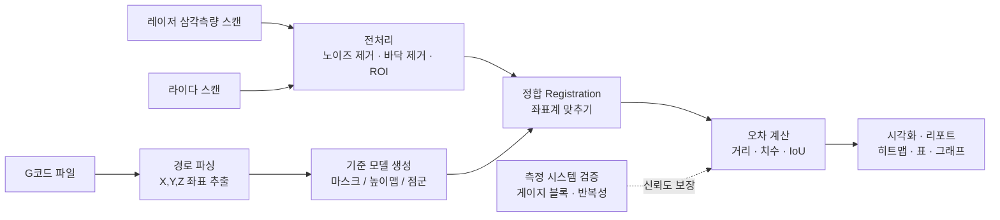

# 청사진: 라이다 · 레이저 삼각측량을 이용한 G코드 대비 형상 오차 정량 측정

> 대상: 대학 소규모 연구실 / 언어: Python / 작성 기준: Python 완전 초보도 단계별로 따라올 수 있게

---

## 0. 한 줄 요약

**"G코드가 원래 만들려던 모양(기준)"** 과 **"센서로 실제로 잰 모양(측정)"** 을 **같은 좌표계에 겹쳐 놓고**,
두 모양의 차이를 **숫자(mm, %, IoU 등)** 로 계산하는 파이프라인을 Python으로 만든다.



---

## 1. 먼저 확정해야 할 것 (프로젝트 정의서)

시작 전에 아래 표를 연구실에서 채워 두세요. 이 값에 따라 나머지 설계가 달라집니다.

| 항목 | 예시 답 | 왜 중요한가 |
|---|---|---|
| 가공 방식 | FDM 3D프린터 / CNC 밀링 / 레이저 가공 | G코드에서 "실제 형상"을 만드는 규칙이 다름 (예: FDM은 선폭·층높이 필요) |
| "마스킹"의 의미 | G코드 경로를 2D 이미지 마스크로 렌더링 / 특정 영역만 잘라서 비교 | 비교 방식(2D vs 3D)이 결정됨 |
| 측정 대상 크기 | 50×50×20 mm | 센서 선택, 스캔 방식 |
| 기대 오차 크기 | ±0.1 mm 수준 | 센서 분해능이 충분한지 판단 (아래 "10배 규칙") |
| 측정하고 싶은 오차 종류 | 치수, 위치, 높이, 형상(윤곽), 표면 | 지표(메트릭) 선택 |
| 센서 모델명 | 예: 라인레이저 프로파일러, RealSense/Livox 등 | 데이터 형식, SDK |

**10배 규칙 (중요)**: 측정 장비의 정밀도는 측정하려는 오차보다 **약 10배 좋아야** 합니다.
- 오차 0.1 mm를 보고 싶다 → 센서 반복정밀도 ≈ 0.01 mm 필요
- 일반적으로 **레이저 삼각측량**은 수~수십 µm급 → **정밀 측정의 주력**
- **라이다**는 보통 mm급 노이즈 → **전체 형상/큰 위치 오차, 또는 두 센서 비교 연구용**

> 즉, 이 과제는 "레이저 삼각측량 = 정밀 기준 측정", "라이다 = 저가/고속 대안이 어느 정도까지 쓸 만한가" 라는 **비교 연구** 구도로 잡으면 논문/보고서 스토리가 깔끔해집니다.

---

## 2. 전체 시스템 구성

### 2.1 하드웨어
- 측정 대상(시편) + 고정 지그
- **기준 마커(Fiducial)**: 베드/지그에 정밀 볼(구) 3개 이상 또는 가공된 기준 홈 → 좌표계 맞추기에 필수
- 레이저 삼각측량 센서 (라인 레이저 + 카메라, 또는 상용 프로파일러) + 이동 스테이지(또는 프린터/CNC 축 자체를 이용해 스캔)
- 라이다 센서
- 검증용 **게이지 블록** 또는 치수를 아는 표준 시편
- PC (Python)

### 2.2 소프트웨어 (Python 라이브러리)
| 라이브러리 | 용도 | 난이도 |
|---|---|---|
| `numpy` | 숫자 배열 계산 (모든 것의 기본) | ★ |
| `pandas` | 결과 표 정리, CSV 저장 | ★ |
| `matplotlib` | 그래프, 히트맵 | ★ |
| `opencv-python` | 2D 마스크, 이미지 처리, 카메라 캘리브레이션 | ★★ |
| `shapely` | 2D 윤곽(폴리곤) 비교, 면적·IoU | ★★ |
| `scipy` | 최근접점 탐색(KDTree), 통계 | ★★ |
| `open3d` | 3D 점군 읽기/보기/필터/ICP 정합/거리 계산 | ★★★ |
| `trimesh` (선택) | 메쉬 처리, 점-메쉬 거리 | ★★★ |

설치 (터미널):
```bash
pip install numpy pandas matplotlib opencv-python shapely scipy open3d trimesh
```

---

## 3. 단계별 파이프라인 (핵심)

### STEP 1. G코드 → 기준 형상 만들기
1. **파싱**: G코드 한 줄씩 읽어서 `G0/G1` 명령의 X, Y, Z (FDM이면 E) 값을 뽑는다.
   - 주의: `G90/G91`(절대/상대 좌표), `G20/G21`(inch/mm), `G92`(좌표 리셋) 처리
   - FDM이면 **E 값이 증가하는 이동만** "실제로 재료가 나간 경로"
2. **경로 → 형상**: 선(경로)에는 두께가 없으므로 두께를 입혀야 함
   - FDM: 선폭(예: 0.4 mm) × 층높이(예: 0.2 mm)
   - CNC: 공구 반경만큼 오프셋
3. **기준 모델 형태 선택** (아래 중 비교 방식에 맞게)
   - **2D 마스크(이미지)**: 층(Z)별로 경로를 선폭만큼 굵게 그린 흑백 이미지 → 윗면/층 윤곽 비교에 적합
   - **높이맵(2.5D)**: XY 격자마다 "있어야 할 높이" → 레이저 삼각측량(위에서 내려다보는 스캔)과 궁합 최고
   - **3D 점군/메쉬**: 전체 형상 비교

초보용 파서 뼈대 예시:
```python
def parse_gcode(path):
    x = y = z = 0.0
    points = []                      # (x, y, z) 목록
    with open(path) as f:
        for line in f:
            line = line.split(";")[0].strip()   # 주석 제거
            if not line.startswith(("G0", "G1")):
                continue
            for word in line.split()[1:]:
                if word[0] == "X": x = float(word[1:])
                if word[0] == "Y": y = float(word[1:])
                if word[0] == "Z": z = float(word[1:])
            points.append((x, y, z))
    return points
```

### STEP 2. 측정 데이터 수집
- **레이저 삼각측량**: 라인 프로파일(한 줄의 높이값)을 스테이지 이동하며 여러 장 → 이어 붙이면 높이맵/점군
  - 사전 작업: 카메라 내부 캘리브레이션 + 레이저 평면 캘리브레이션 (DIY 센서인 경우)
  - 엔코더/스텝 간격으로 Y방향 좌표 부여
- **라이다**: 점군 파일(`.pcd`, `.ply`, `.csv`)로 저장. 여러 프레임 평균하면 노이즈 감소
- **기록 규칙**: 파일명에 `시편ID_센서_반복번호_날짜` (예: `S01_laser_r03_20261006.ply`), 실험 조건은 별도 CSV에 기록

### STEP 3. 전처리
1. **ROI 자르기**: 시편 주변만 남김
2. **이상치 제거**: Open3D `remove_statistical_outlier`
3. **바닥 평면 제거/기준화**: RANSAC 평면 추정(`segment_plane`) → 바닥을 Z=0으로 맞춤
4. **다운샘플링**: `voxel_down_sample` (계산 속도)
5. (높이맵 방식이면) 격자 보간으로 균일한 XY 그리드로 변환

### STEP 4. 정합 (Registration) — 가장 중요하고 가장 실수하기 쉬운 단계
측정 데이터와 G코드 기준은 좌표계가 다르므로 겹쳐야 비교할 수 있습니다.

| 방법 | 설명 | 장단점 |
|---|---|---|
| **A. 기준 마커 정합 (권장)** | 베드의 정밀 볼 3개 중심을 양쪽에서 찾아 강체 변환 계산 | **위치 오차까지 측정 가능**, 정직한 결과 |
| B. 초기 정렬 + ICP | 대략 맞춘 후 ICP로 미세 정합 | 편하지만 **오차를 '흡수'해 버림** |

> ⚠️ **ICP 함정**: ICP는 "두 모양이 최대한 겹치도록" 옮기기 때문에, 시편이 통째로 0.3 mm 밀려 출력됐어도 그 오차를 지워 버립니다.
> → **"위치 오차"는 마커 정합으로**, **"형상 오차"는 ICP 정합 후** 로 **둘 다 계산해서 구분 보고**하세요.

### STEP 5. 오차 계산 (정량 지표)

| 범주 | 지표 | 계산 방법 | 단위 |
|---|---|---|---|
| 점 단위 편차 | 부호 있는 거리(+ 과다 / − 부족) | 측정점 → 기준 표면 최근접 거리 (KDTree, 점-메쉬 거리) | mm |
| 요약 통계 | 평균(편향), 표준편차, **RMS**, 최대, **P95** | numpy | mm |
| 높이 | 높이맵 차이 `측정 − 기준` | 격자별 빼기 | mm |
| 2D 윤곽 | **IoU**, Dice, 면적 오차 | 마스크 겹침 / shapely | %, mm² |
| 2D 윤곽 | **Hausdorff 거리**, 평균 윤곽 거리 | OpenCV/scipy | mm |
| 치수 | 길이·폭·높이·구멍 지름 오차 | 특징 추출 후 설계값 비교 | mm, % |
| 위치 | 중심 위치 오차, 회전 오차 | 마커 정합 후 중심 비교 | mm, ° |
| 선 단위 (FDM) | 선폭 오차, 경로 이탈량 | 경로 수직 단면 프로파일 분석 | mm |
| 허용 공차 | 공차 내 점 비율 | `|편차| ≤ 공차` 비율 | % |

**보고 원칙**: 평균 하나만 쓰지 말고 **평균 ± 표준편차, RMS, P95, 최대**를 함께 → 국부 결함과 전체 경향을 구분 가능.

### STEP 6. 시각화 & 리포트
- 편차 **컬러 히트맵** (파랑=부족, 빨강=과다, 0=흰색) — 형상 위에 덮어 표시
- 편차 **히스토그램**
- 마스크 **오버레이** (기준=초록, 측정=빨강, 겹침=노랑)
- 시편/센서별 결과 **요약 표(CSV/엑셀)**
- 센서 비교: **Bland–Altman 플롯** (레이저 vs 라이다)

---

## 4. 측정 시스템 자체의 신뢰도 검증 (연구로서의 핵심)

"측정한 오차"가 **진짜 가공 오차인지, 센서 오차인지** 증명해야 합니다.

1. **정확도(Accuracy)**: 치수를 아는 게이지 블록/표준 시편을 측정 → 참값과 비교
2. **반복성(Repeatability)**: 같은 시편을 그대로 두고 10회 스캔 → 표준편차
3. **재현성(Reproducibility)**: 시편을 뺐다 다시 놓고 / 다른 사람이 측정 → 편차
4. **Gage R&R**: 위 2·3을 정식 분석 (측정 시스템 변동이 전체 변동의 10% 이하면 우수, 30% 이상이면 부적합)
5. **불확도 예산(Uncertainty budget)**: 센서 노이즈 + 캘리브레이션 + 정합 + 온도 등 각 요인 합산

---

## 5. 실험 설계

**시편 (Test artifact) 예시** — 오차 종류별로 하나씩:
- 계단형 블록 (높이 오차) / 정육면체 (치수) / 원기둥·구멍 (원형도·지름) / 얇은 벽·좁은 틈 (분해능 한계) / 오버행 (형상 결함)

**변수 예시**: 속도, 층높이, 온도, 경로 패턴 등 (가공 변수) × 센서 종류 (측정 변수)

**반복 수**: 조건당 시편 3개 이상 × 스캔 3회 이상 → 평균/분산, 필요 시 ANOVA로 유의성 검정

---

## 6. 폴더 구조 제안

```
cv-lab/
├── data/
│   ├── gcode/          # 원본 G코드
│   ├── raw/            # 센서 원본 데이터 (수정 금지!)
│   ├── processed/      # 전처리 결과
│   └── experiments.csv # 실험 조건 기록표
├── src/
│   ├── gcode_parser.py     # STEP 1
│   ├── reference_model.py  # STEP 1 (마스크/높이맵 생성)
│   ├── preprocess.py       # STEP 3
│   ├── registration.py     # STEP 4
│   ├── metrics.py          # STEP 5
│   └── visualize.py        # STEP 6
├── notebooks/          # Jupyter로 실험·확인
├── results/            # 그림, 표
├── docs/BLUEPRINT.md   # 이 문서
└── requirements.txt
```

---

## 7. 일정 & 마일스톤 (약 16주 예시)

| 주차 | 단계 | 산출물 (완료 기준) |
|---|---|---|
| 1–2 | Python 기초 + 환경 세팅 | numpy/matplotlib로 그래프 그리기, Git 사용 |
| 3–4 | **G코드 파서 & 기준 모델** | G코드 경로를 matplotlib로 그려서 슬라이서 화면과 같음을 확인 |
| 5–6 | 센서 데이터 수집 & 캘리브레이션 | 게이지 블록 측정값이 참값과 일치 (오차 기록) |
| 7–8 | 전처리 & 점군 시각화 | Open3D로 깨끗한 시편 점군 확인 |
| 9–10 | **정합** | 마커 정합 + ICP 둘 다 구현, 정합 잔차 보고 |
| 11–12 | **오차 지표 & 시각화** | 히트맵·히스토그램·요약표 자동 생성 |
| 13–14 | 측정 시스템 검증 (반복성, Gage R&R) | 센서별 불확도 표 |
| 15–16 | 본 실험 & 분석 & 보고서 | 조건별 오차 비교, 레이저 vs 라이다 결론 |

**검증 팁 – 합성 데이터로 먼저 테스트**: 센서 데이터 없이도, G코드 기준 점군을 일부러 0.2 mm 옮기고 노이즈를 넣은 "가짜 측정"을 만들어서
코드가 0.2 mm를 정확히 찾아내는지 확인하세요. 정답을 아는 데이터로 코드를 검증하는 것이 가장 확실합니다.

---

## 8. 위험 요소 & 대응

| 위험 | 증상 | 대응 |
|---|---|---|
| 반사/광택 표면 | 레이저 점 튐, 구멍 난 데이터 | 무광 스프레이(두께 µm 단위 기록), 노출 조정 |
| 가림(Occlusion) | 벽 옆면/구멍 내부 데이터 없음 | 여러 각도 스캔, 측정 불가 영역은 지표에서 제외 명시 |
| 라이다 정밀도 부족 | 오차보다 노이즈가 큼 | 다중 프레임 평균, 큰 오차/전체 형상 용도로 한정 |
| ICP가 오차 흡수 | 위치 오차 0으로 나옴 | 기준 마커 정합 병행 |
| 단위/좌표 실수 | 결과가 25.4배 / 뒤집힘 | G20/G21 확인, 축 방향 테스트 시편(비대칭 모양) 사용 |
| G코드 ≠ 실제 형상 | 선폭·공구반경 미반영 | 기준 모델에 선폭/오프셋 적용 |
| 온도·진동 | 반복 측정값 흔들림 | 측정 환경 기록, 워밍업 후 측정 |

---

## 9. 초보자 학습 로드맵 (Python)

1. **기초 문법**: 변수, 리스트, for문, if문, 함수, 파일 읽기 → G코드 파서를 직접 짜면서 익히기
2. **numpy**: 배열, 슬라이싱, `mean/std/max` → 오차 통계
3. **matplotlib**: `plot`, `scatter`, `imshow`, `hist` → 시각화
4. **pandas**: CSV 읽고 쓰기 → 실험 결과 관리
5. **OpenCV**: 이미지 그리기(`cv2.polylines`), 마스크 연산 → 2D 비교
6. **Open3D**: 점군 읽기/보기/필터/ICP → 3D 비교
7. **Jupyter Notebook** 으로 단계마다 결과를 눈으로 확인하며 진행 권장

---

## 10. 최종 산출물 체크리스트

- [ ] G코드 → 기준 모델 변환 코드
- [ ] 센서별 캘리브레이션 결과 및 불확도
- [ ] 정합 코드 (마커 기반 + ICP)
- [ ] 오차 지표 자동 계산 스크립트 (CSV 출력)
- [ ] 히트맵/히스토그램/오버레이 그림
- [ ] 레이저 vs 라이다 비교 분석
- [ ] 실험 조건별 오차 분석 결과 및 보고서
