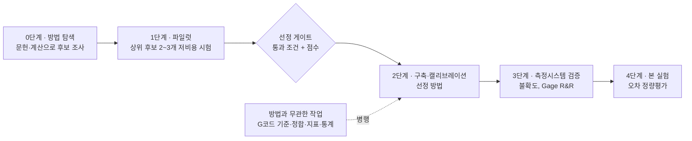

# 중심 주제

> 이 저장소의 모든 청사진·계획·작업은 이 문서를 기준으로 판단합니다.
> 작업이 끝날 때마다 [§6의 점검 질문](#6-작업이-끝날-때마다-하는-점검)으로 이 문서와 대조합니다.

---

## 1. 궁극적인 목표

**G코드(마스킹된 기준 형상)와 실제로 만들어진 결과물을 비교해서, 가공 오차를 정량적으로 평가한다.**

- "정량적"이란 오차를 **숫자(mm, µm, %, IoU 등)와 그 숫자의 불확도**로 말할 수 있다는 뜻입니다.
- 평가할 오차의 종류는 [A1. 오차의 정의](blueprints/A-goals/A1-error-definition.md)를 따릅니다.
  높이, 윤곽, 치수, 위치, 배율, 선(비드), 표면 오차입니다.
- 목표 정밀도는 [A2. 요구 정밀도](blueprints/A-goals/A2-precision-spec.md)를 따릅니다.

| 측정 목표 | 크기 | 측정에 필요한 정밀도 (10:1 규칙, 최소 4:1) |
|---|---|---|
| 층 높이 오차 | ±0.02 mm | 2~5 µm |
| 선폭 오차 | ±0.04 mm | XY 점 간격 0.02~0.04 mm |
| 치수 오차 | ±0.1 mm | 10~25 µm |

## 2. 수단은 열려 있다

**측정 방법은 정해져 있지 않습니다.**
레이저 삼각측량은 지금까지 가장 자세히 설계한 **1순위 후보**일 뿐입니다.
하드웨어와 소프트웨어 방식을 폭넓게 조사하고, 직접 시험해 보고, **가장 효율적인 방법**을 골라 그 방법으로 목표에 도달합니다.
필요하면 여러 방법을 조합합니다. 예를 들어 높이는 A 방법으로, 윤곽은 B 방법으로 잴 수 있습니다.

조사 대상과 결과는 [방법 탐색](0_방법탐색/README.md)에 정리합니다.

## 3. "가장 효율적인 방법"의 정의

**목표 정밀도를 만족하는 방법 중에서, 비용·시간·노력이 가장 적게 드는 방법**을 고릅니다.
정밀도는 점수로 상쇄되지 않는 **통과 조건**이고, 나머지는 가중 점수로 비교합니다.

### 3.1 통과 조건 (하나라도 못 맞추면 탈락)

| 조건 | 기준 |
|---|---|
| 정밀도 | 핵심 오차(높이·윤곽·치수 중 최소 2종)를 §1 표의 정밀도로 잴 수 있다 (최소 4:1) |
| G코드 비교 가능성 | 측정 결과를 G코드 좌표계에 맞춰 비교할 수 있다 |
| 안전·규정 | 연구실 안전 규정 안에서 운용할 수 있다 |
| 예산 | 연구실 예산 범위 안에서 구축하거나 빌려 쓸 수 있다 |

### 3.2 비교 점수 (각 1~5점 × 가중치)

| 기준 | 가중치 | 5점이면 |
|---|---|---|
| 정밀도 여유 | 20 % | 목표 정밀도보다 10배 이상 좋다 |
| 측정할 수 있는 오차 종류 | 15 % | A1의 7종 대부분 |
| 비용 | 15 % | 이미 있는 장비, 또는 수십만 원 이하 |
| 구축·학습 난이도 | 15 % | 초보자가 2주 안에 첫 측정 가능 |
| 측정 속도·자동화 | 10 % | 시편 1개를 수 분 안에, 사람 손 없이 |
| 재질·표면 의존성 | 10 % | 색·광택·반투명에 거의 영향받지 않음 |
| 공정 중(층별) 측정 가능성 | 5 % | 프린터 안에서 층마다 측정 가능 |
| 검증 용이성 | 5 % | 기준물·교차검증으로 불확도를 쉽게 증명 |
| 연구 기여도 | 5 % | 새로움이 있어 논문·보고서 가치가 높음 |

> 가중치는 연구실 사정에 맞게 바꿀 수 있습니다. 바꾸면 이 표와 [비교표](0_방법탐색/비교-선정.md)를 함께 고칩니다.

## 4. 진행 단계

| 단계 | 기간 (안) | 결과물 |
|---|---|---|
| 0. 방법 탐색 | W1–W2 (2026-10-06 ~ 10-19) | 방법별 조사 문서, 1차 점수표 |
| 1. 파일럿 | W3–W4 (2026-10-20 ~ 11-02) | 상위 2~3개 후보의 시험 측정 결과 |
| **선정 게이트** | **2026-11-02** | **방법 선정 기록 (조합 포함)** |
| 2~4단계 | W5 이후 | 기존 청사진 일정을 선정 결과에 맞게 조정 |

- **방법과 무관한 작업**은 0~1단계와 **병행**합니다. 시간을 잃지 않기 위해서입니다.
  G코드 파싱·기준 모델(G), 정합·지표(H), 소프트웨어(J), 불확도 틀(I)이 여기에 해당합니다.
- 레이저 삼각측량 설계(B·D·F 등)는 **1순위 후보의 설계안**으로 유지합니다.
  선정 결과가 다르면 해당 영역을 선정된 방법에 맞게 다시 씁니다.

## 5. 기존 청사진의 위치

| 영역 | 방법 의존성 | 선정 후 처리 |
|---|---|---|
| A. 목표·요구사항 | 무관 | 그대로 사용 (중심 기준) |
| B. 측정 원리·광학 | **레이저 삼각측량 전용** | 선정 방법의 원리·하드웨어 설계로 교체 또는 유지 |
| C. 기구·환경·안전 | 일부 의존 | 스캔 장치·안전은 선정 방법에 맞게 수정, 좌표계·온도·진동은 유지 |
| D. 캘리브레이션 | **대부분 의존** | 선정 방법의 캘리브레이션으로 교체 (D4 G코드 좌표 변환·D5 검증 틀은 유지) |
| E. 측정 대상 | 일부 의존 | 시편 설계(E3) 유지, 표면 영향(E1)·가림(E2)은 방법에 맞게 수정 |
| F. 데이터 획득 | **대부분 의존** | 선정 방법의 획득 방식으로 교체 (F3 저장 형식은 유지) |
| G. G코드 기준 모델 | 무관 | 그대로 사용 |
| H. 처리·분석 | 거의 무관 | 그대로 사용 (입력 형식만 맞춤) |
| I. 신뢰성 검증 | 무관 | 그대로 사용 |
| J. 소프트웨어 | 무관 | 그대로 사용 (획득 모듈만 교체) |
| K. 프로젝트 운영 | 무관 | 일정·예산을 선정 결과로 갱신 |

## 6. 작업이 끝날 때마다 하는 점검

모든 청사진·계획·작업은 완료 시 아래 질문에 답하고, 그 결과를 [검토 기록](검토-기록.md)에 남깁니다.

1. **목표 기여**: 이 결과가 "가공 오차의 정량평가"에 어떻게 기여하는가? 기여가 없다면 왜 했는가?
2. **수단 중립성**: 특정 방법을 미리 전제하지 않았는가? 방법에 묶인 내용이라면 그 사실을 문서에 표시했는가?
3. **효율**: 같은 결과를 더 싸고 빠르고 쉽게 얻는 방법은 없는가?
4. **일관성**: 상위 문서(이 문서, A1·A2, 전체 청사진)의 수치·용어·부호 규칙과 맞는가?
5. **연결**: 다음 작업이 이 결과를 받아 쓸 수 있는가? 빠진 연결 고리는 없는가?
6. **정량성**: 결과에 숫자와 불확도(또는 그 근거)가 있는가?

어긋난 점이 있으면 하위 문서를 고치거나, 근거가 충분하면 상위 문서를 고칩니다. 어느 쪽을 고쳤는지 검토 기록에 남깁니다.
